# Sommerhus Architecture Diagrams

> **Purpose**: Visual reference for developers to understand the system structure, data flow, and key patterns.
> All diagrams use [Mermaid](https://mermaid.js.org/) syntax and render natively on GitHub.

---

## Table of Contents

1. [C4 Context Diagram](#1-c4-context-diagram)
2. [C4 Container Diagram](#2-c4-container-diagram)
3. [C4 Component Diagram – API](#3-c4-component-diagram--api)
4. [C4 Component Diagram – MVC](#4-c4-component-diagram--mvc)
5. [Solution Layer Architecture](#5-solution-layer-architecture)
6. [Project Dependency Graph](#6-project-dependency-graph)
7. [Domain Entity-Relationship Diagram](#7-domain-entity-relationship-diagram)
8. [Pricing Domain Model](#8-pricing-domain-model)
9. [Data Flow – Admin CRUD (Create House)](#9-data-flow--admin-crud-create-house)
10. [Data Flow – Public Read (View House)](#10-data-flow--public-read-view-house)
11. [Data Transformation Layers](#11-data-transformation-layers)
12. [Authentication & Authorization](#12-authentication--authorization)
13. [Admin Login Sequence](#13-admin-login-sequence)
14. [Public User Registration & Login](#14-public-user-registration--login)
15. [JWT Token Forwarding (MVC → API)](#15-jwt-token-forwarding-mvc--api)
16. [Image Handling](#16-image-handling)
17. [Image Upload Sequence](#17-image-upload-sequence)
18. [Pricing Engine Pipeline](#18-pricing-engine-pipeline)
19. [Price Quote Sequence](#19-price-quote-sequence)
20. [Booking Lifecycle](#20-booking-lifecycle)
21. [Entity Lifecycle (Draft → Published → Archived)](#21-entity-lifecycle-draft--published--archived)
22. [Availability & Booking Integration](#22-availability--booking-integration)
23. [ServiceResult Pattern](#23-serviceresult-pattern)
24. [ServiceResult → HTTP Response Mapping](#24-serviceresult--http-response-mapping)
25. [Audit System](#25-audit-system)
26. [API Error Handling Pipeline](#26-api-error-handling-pipeline)
27. [MVC API Client Architecture](#27-mvc-api-client-architecture)
28. [Service Registration Overview](#28-service-registration-overview)
29. [Database Provider Selection](#29-database-provider-selection)
30. [Application Startup Sequence](#30-application-startup-sequence)
31. [Use Cases by Role](#31-use-cases-by-role)

---

## 1. C4 Context Diagram

Who uses the system and what external dependencies exist.

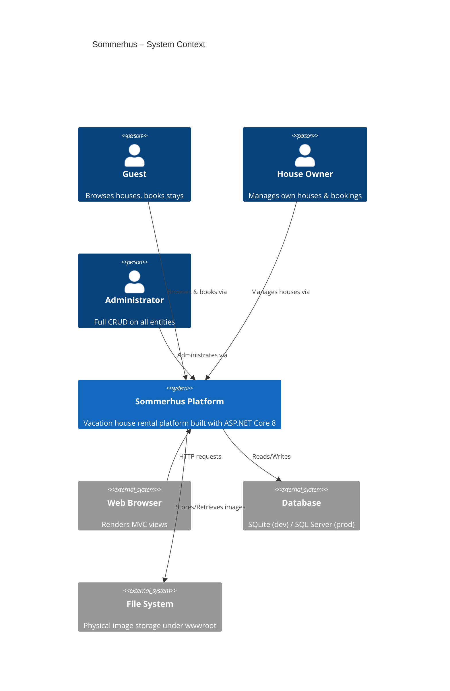
```mermaid
C4Context
    title Sommerhus – System Context

    Person(guest, "Guest", "Browses houses, books stays")
    Person(owner, "House Owner", "Manages own houses & bookings")
    Person(admin, "Administrator", "Full CRUD on all entities")

    System(sommerhus, "Sommerhus Platform", "Vacation house rental platform built with ASP.NET Core 8")

    System_Ext(browser, "Web Browser", "Renders MVC views")
    System_Ext(db, "Database", "SQLite (dev) / SQL Server (prod)")
    System_Ext(fs, "File System", "Physical image storage under wwwroot")

    Rel(guest, sommerhus, "Browses & books via")
    Rel(owner, sommerhus, "Manages houses via")
    Rel(admin, sommerhus, "Administrates via")
    Rel(sommerhus, db, "Reads/Writes")
    Rel(sommerhus, fs, "Stores/Retrieves images")
    Rel(browser, sommerhus, "HTTP requests")
```

---

## 2. C4 Container Diagram

The deployable units and how they communicate.

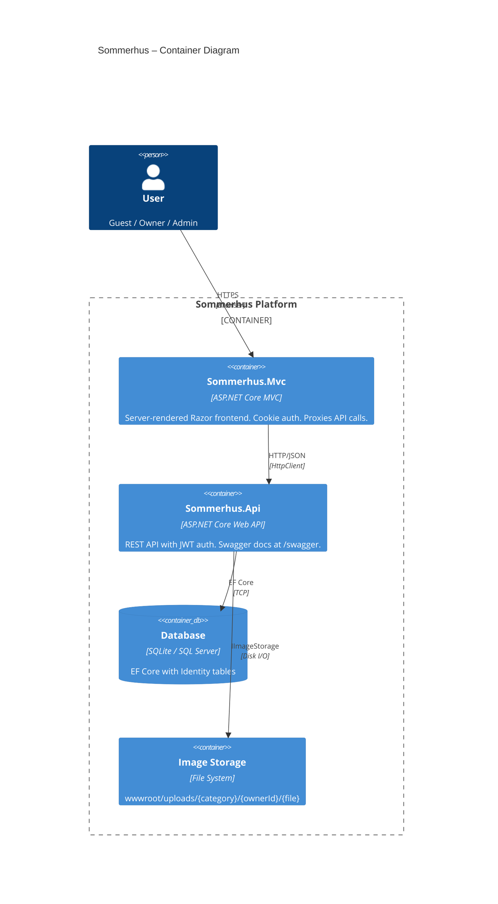
```mermaid
C4Container
    title Sommerhus – Container Diagram

    Person(user, "User", "Guest / Owner / Admin")

    Container_Boundary(platform, "Sommerhus Platform") {
        Container(mvc, "Sommerhus.Mvc", "ASP.NET Core MVC", "Server-rendered Razor frontend. Cookie auth. Proxies API calls.")
        Container(api, "Sommerhus.Api", "ASP.NET Core Web API", "REST API with JWT auth. Swagger docs at /swagger.")
        ContainerDb(db, "Database", "SQLite / SQL Server", "EF Core with Identity tables")
        Container(storage, "Image Storage", "File System", "wwwroot/uploads/{category}/{ownerId}/{file}")
    }

    Rel(user, mvc, "HTTPS", "Browser")
    Rel(mvc, api, "HTTP/JSON", "HttpClient")
    Rel(api, db, "EF Core", "TCP")
    Rel(api, storage, "IImageStorage", "Disk I/O")
```

---

## 3. C4 Component Diagram – API

Internal structure of the API container.

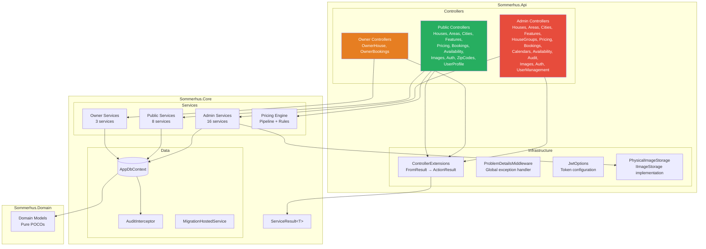
```mermaid
graph TB
    subgraph "Sommerhus.Api"
        direction TB
        subgraph Controllers
            AC[Admin Controllers<br/>Houses, Areas, Cities, Features,<br/>HouseGroups, Pricing, Bookings,<br/>Calendars, Availability, Audit,<br/>Images, Auth, UserManagement]
            OC[Owner Controllers<br/>OwnerHouse, OwnerBookings]
            PC[Public Controllers<br/>Houses, Areas, Cities, Features,<br/>Pricing, Bookings, Availability,<br/>Images, Auth, ZipCodes, UserProfile]
        end

        subgraph Infrastructure
            CE[ControllerExtensions<br/>FromResult → ActionResult]
            PDM[ProblemDetailsMiddleware<br/>Global exception handler]
            JWT[JwtOptions<br/>Token configuration]
            PIS[PhysicalImageStorage<br/>IImageStorage implementation]
        end
    end

    subgraph "Sommerhus.Core"
        direction TB
        subgraph Services
            AS[Admin Services<br/>16 services]
            PS[Public Services<br/>8 services]
            OS[Owner Services<br/>3 services]
            PE[Pricing Engine<br/>Pipeline + Rules]
        end

        subgraph Data
            DB[(AppDbContext)]
            AI[AuditInterceptor]
            MIG[MigrationHostedService]
        end

        SR[ServiceResult&lt;T&gt;]
    end

    subgraph "Sommerhus.Domain"
        DM[Domain Models<br/>Pure POCOs]
    end

    AC & OC & PC --> CE
    CE --> SR
    AC --> AS
    OC --> OS
    PC --> PS & PE
    AS & PS & OS --> DB
    DB --> AI
    DB --> DM
    AS --> PIS

    style AC fill:#e74c3c,color:#fff
    style OC fill:#e67e22,color:#fff
    style PC fill:#27ae60,color:#fff
```

---

## 4. C4 Component Diagram – MVC

Internal structure of the MVC frontend container.

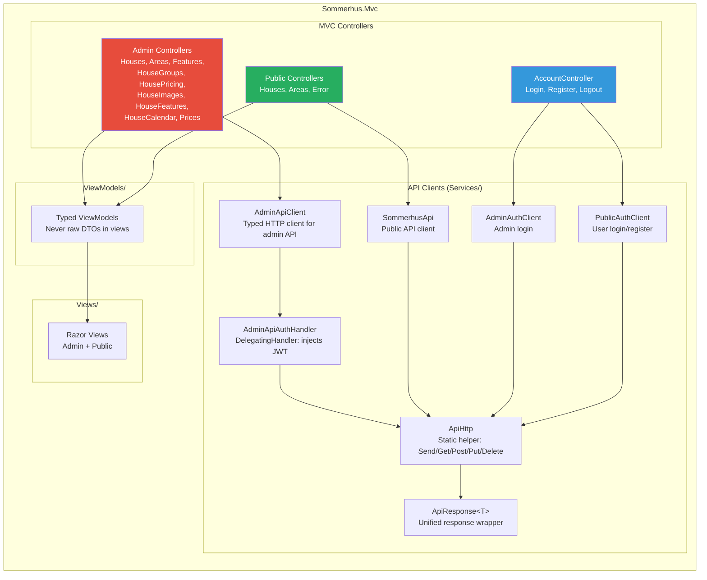
```mermaid
graph TB
    subgraph "Sommerhus.Mvc"
        direction TB
        subgraph "MVC Controllers"
            MAC[Admin Controllers<br/>Houses, Areas, Features,<br/>HouseGroups, HousePricing,<br/>HouseImages, HouseFeatures,<br/>HouseCalendar, Prices]
            MPC[Public Controllers<br/>Houses, Areas, Error]
            MACC[AccountController<br/>Login, Register, Logout]
        end

        subgraph "API Clients (Services/)"
            AAC[AdminApiClient<br/>Typed HTTP client for admin API]
            SAC[SommerhusApi<br/>Public API client]
            AAUTH[AdminAuthClient<br/>Admin login]
            PAUTH[PublicAuthClient<br/>User login/register]
            AHANDLER[AdminApiAuthHandler<br/>DelegatingHandler: injects JWT]
            APIHTTP[ApiHttp<br/>Static helper: Send/Get/Post/Put/Delete]
            APIRESP[ApiResponse&lt;T&gt;<br/>Unified response wrapper]
        end

        subgraph "ViewModels/"
            VM[Typed ViewModels<br/>Never raw DTOs in views]
        end

        subgraph "Views/"
            VW[Razor Views<br/>Admin + Public]
        end
    end

    MAC --> AAC
    MPC --> SAC
    MACC --> AAUTH & PAUTH
    AAC --> AHANDLER --> APIHTTP
    SAC --> APIHTTP
    AAUTH & PAUTH --> APIHTTP
    APIHTTP --> APIRESP
    MAC & MPC --> VM --> VW

    style MAC fill:#e74c3c,color:#fff
    style MPC fill:#27ae60,color:#fff
    style MACC fill:#3498db,color:#fff
```

---

## 5. Solution Layer Architecture

How the projects relate as logical layers.

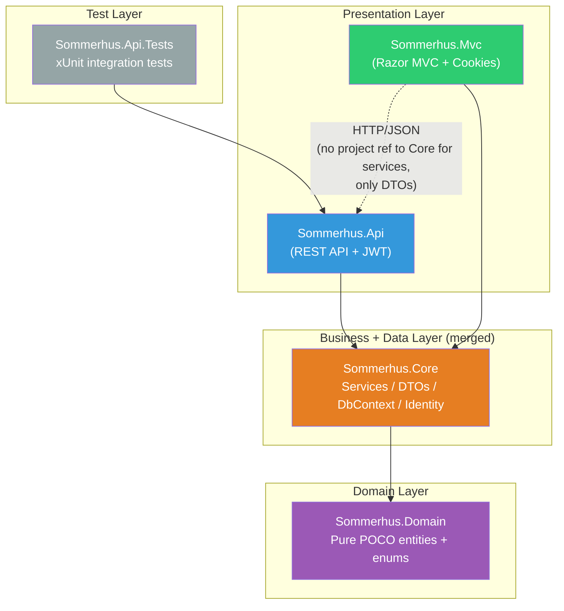
```mermaid
graph TB
    subgraph "Presentation Layer"
        API["Sommerhus.Api<br/>(REST API + JWT)"]
        MVC["Sommerhus.Mvc<br/>(Razor MVC + Cookies)"]
    end

    subgraph "Business + Data Layer (merged)"
        CORE["Sommerhus.Core<br/>Services / DTOs / DbContext / Identity"]
    end

    subgraph "Domain Layer"
        DOMAIN["Sommerhus.Domain<br/>Pure POCO entities + enums"]
    end

    subgraph "Test Layer"
        TESTS["Sommerhus.Api.Tests<br/>xUnit integration tests"]
    end

    API --> CORE
    MVC -.->|"HTTP/JSON<br/>(no project ref to Core for services,<br/>only DTOs)"| API
    MVC --> CORE
    CORE --> DOMAIN
    TESTS --> API

    style API fill:#3498db,color:#fff
    style MVC fill:#2ecc71,color:#fff
    style CORE fill:#e67e22,color:#fff
    style DOMAIN fill:#9b59b6,color:#fff
    style TESTS fill:#95a5a6,color:#fff
```

> **Key insight**: MVC references Core only for DTO types and service interfaces (not implementations).
> All actual service calls go through HTTP to the API.

---

## 6. Project Dependency Graph

Compile-time project references.

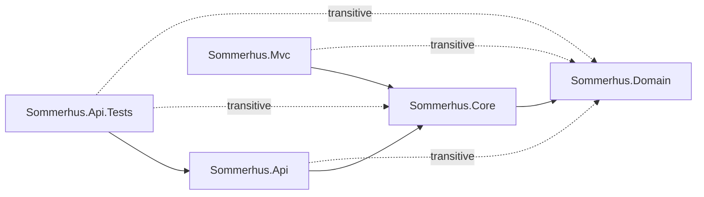
```mermaid
graph LR
    API[Sommerhus.Api] --> CORE[Sommerhus.Core]
    CORE --> DOMAIN[Sommerhus.Domain]
    MVC[Sommerhus.Mvc] --> CORE
    TESTS[Sommerhus.Api.Tests] --> API

    API -.->|transitive| DOMAIN
    MVC -.->|transitive| DOMAIN
    TESTS -.->|transitive| CORE
    TESTS -.->|transitive| DOMAIN
```

---

## 7. Domain Entity-Relationship Diagram

Core business entities and their relationships.

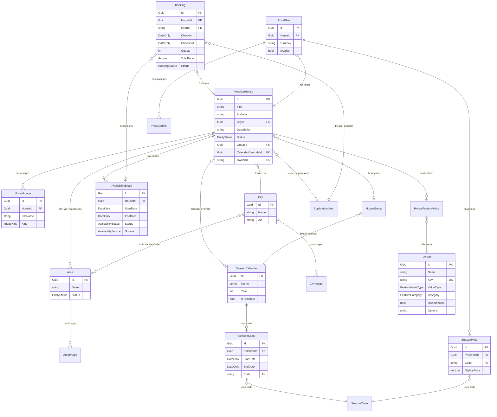
```mermaid
erDiagram
    VacationHouse ||--o{ HouseImage : "has images"
    VacationHouse ||--o{ HouseFeatureValue : "has features"
    VacationHouse ||--o{ AvailabilityBlock : "has blocks"
    VacationHouse }o--|| City : "located in"
    VacationHouse }o--o| HouseGroup : "belongs to"
    VacationHouse }o--o| SeasonCalendar : "calendar override"
    VacationHouse }o--o| ApplicationUser : "owned by (OwnerId)"
    VacationHouse }o--o{ Area : "M:N via HouseAreas"

    City }o--o{ Area : "M:N via AreaCities"
    City ||--o{ CityImage : "has images"

    Area ||--o{ AreaImage : "has images"

    HouseFeatureValue }o--|| Feature : "references"

    Booking }o--|| VacationHouse : "for house"
    Booking }o--|| ApplicationUser : "by user (UserId)"
    Booking }o--o| AvailabilityBlock : "linked block"

    HouseGroup }o--o| SeasonCalendar : "default calendar"
    SeasonCalendar ||--o{ SeasonSpan : "has spans"
    SeasonSpan }o--|| SeasonCode : "uses code"

    PricePlan }o--|| VacationHouse : "for house"
    PricePlan ||--o{ SeasonPrice : "has prices"
    PricePlan ||--o{ PriceModifier : "has modifiers"
    SeasonPrice }o--|| SeasonCode : "uses code"

    VacationHouse {
        Guid Id PK
        string Title
        string Address
        Guid CityId FK
        string Description
        EntityStatus Status
        Guid GroupId FK
        Guid CalendarOverrideId FK
        string OwnerId FK
    }

    City {
        Guid Id PK
        string Name
        string Zip
    }

    Area {
        Guid Id PK
        string Name
        EntityStatus Status
    }

    Feature {
        Guid Id PK
        string Name
        string Key UK
        FeatureValueType ValueType
        FeatureCategory Category
        bool IsSearchable
        string Options
    }

    HouseImage {
        Guid Id PK
        Guid HouseId FK
        string FileName
        ImageKind Kind
    }

    Booking {
        Guid Id PK
        Guid HouseId FK
        string UserId FK
        DateOnly CheckIn
        DateOnly CheckOut
        int Guests
        decimal TotalPrice
        BookingStatus Status
    }

    PricePlan {
        Guid Id PK
        Guid HouseId FK
        string Currency
        bool IsActive
    }

    SeasonPrice {
        Guid Id PK
        Guid PricePlanId FK
        string Code FK
        decimal NightlyPrice
    }

    SeasonCalendar {
        Guid Id PK
        string Name
        int Year
        bool IsTemplate
    }

    SeasonSpan {
        Guid Id PK
        Guid CalendarId FK
        DateOnly StartDate
        DateOnly EndDate
        string Code FK
    }

    AvailabilityBlock {
        Guid Id PK
        Guid HouseId FK
        DateOnly StartDate
        DateOnly EndDate
        AvailabilityStatus Status
        AvailabilitySource Source
    }
```

---

## 8. Pricing Domain Model

Focused view of the pricing subsystem entities.

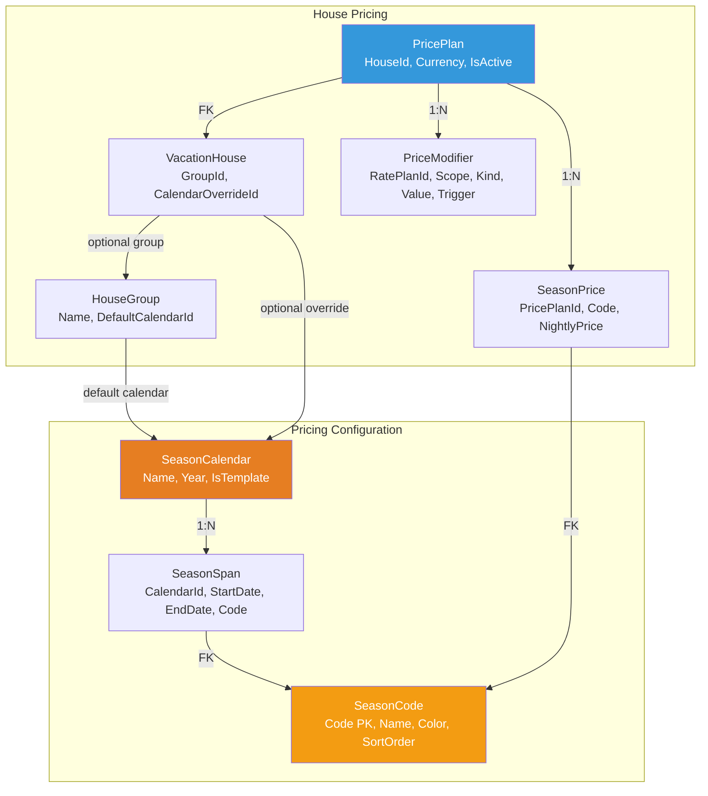
```mermaid
graph TB
    subgraph "Pricing Configuration"
        SC[SeasonCode<br/>Code PK, Name, Color, SortOrder]
        CAL[SeasonCalendar<br/>Name, Year, IsTemplate]
        SPAN[SeasonSpan<br/>CalendarId, StartDate, EndDate, Code]
    end

    subgraph "House Pricing"
        HG[HouseGroup<br/>Name, DefaultCalendarId]
        VH[VacationHouse<br/>GroupId, CalendarOverrideId]
        PP[PricePlan<br/>HouseId, Currency, IsActive]
        SP[SeasonPrice<br/>PricePlanId, Code, NightlyPrice]
        PM[PriceModifier<br/>RatePlanId, Scope, Kind, Value, Trigger]
    end

    CAL -->|"1:N"| SPAN
    SPAN -->|"FK"| SC
    HG -->|"default calendar"| CAL
    VH -->|"optional override"| CAL
    VH -->|"optional group"| HG
    PP -->|"FK"| VH
    PP -->|"1:N"| SP
    PP -->|"1:N"| PM
    SP -->|"FK"| SC

    style SC fill:#f39c12,color:#fff
    style CAL fill:#e67e22,color:#fff
    style PP fill:#3498db,color:#fff
```

> **Calendar resolution**: House uses `CalendarOverrideId` if set, otherwise falls back to `HouseGroup.DefaultCalendarId`.

---

## 9. Data Flow – Admin CRUD (Create House)

Full round-trip for an admin creating a house through the MVC frontend.

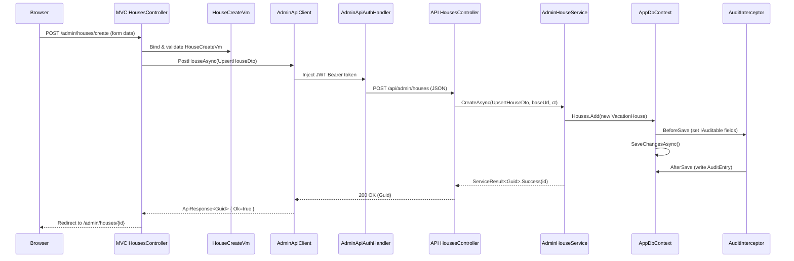
```mermaid
sequenceDiagram
    participant B as Browser
    participant MC as MVC HousesController
    participant VM as HouseCreateVm
    participant AAC as AdminApiClient
    participant AH as AdminApiAuthHandler
    participant API as API HousesController
    participant SVC as AdminHouseService
    participant DB as AppDbContext
    participant AUD as AuditInterceptor

    B->>MC: POST /admin/houses/create (form data)
    MC->>VM: Bind & validate HouseCreateVm
    MC->>AAC: PostHouseAsync(UpsertHouseDto)
    AAC->>AH: Inject JWT Bearer token
    AH->>API: POST /api/admin/houses (JSON)
    API->>SVC: CreateAsync(UpsertHouseDto, baseUrl, ct)
    SVC->>DB: Houses.Add(new VacationHouse)
    DB->>AUD: BeforeSave (set IAuditable fields)
    DB->>DB: SaveChangesAsync()
    AUD->>DB: AfterSave (write AuditEntry)
    SVC-->>API: ServiceResult<Guid>.Success(id)
    API-->>AAC: 200 OK (Guid)
    AAC-->>MC: ApiResponse<Guid> { Ok=true }
    MC-->>B: Redirect to /admin/houses/{id}
```

---

## 10. Data Flow – Public Read (View House)

How a guest sees a house detail page.

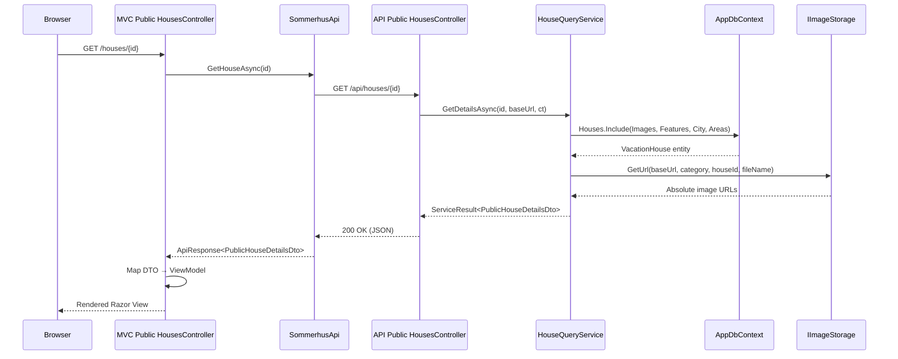
```mermaid
sequenceDiagram
    participant B as Browser
    participant MC as MVC Public HousesController
    participant SA as SommerhusApi
    participant API as API Public HousesController
    participant SVC as HouseQueryService
    participant DB as AppDbContext
    participant IMG as IImageStorage

    B->>MC: GET /houses/{id}
    MC->>SA: GetHouseAsync(id)
    SA->>API: GET /api/houses/{id}
    API->>SVC: GetDetailsAsync(id, baseUrl, ct)
    SVC->>DB: Houses.Include(Images, Features, City, Areas)
    DB-->>SVC: VacationHouse entity
    SVC->>IMG: GetUrl(baseUrl, category, houseId, fileName)
    IMG-->>SVC: Absolute image URLs
    SVC-->>API: ServiceResult<PublicHouseDetailsDto>
    API-->>SA: 200 OK (JSON)
    SA-->>MC: ApiResponse<PublicHouseDetailsDto>
    MC->>MC: Map DTO → ViewModel
    MC-->>B: Rendered Razor View
```

---

## 11. Data Transformation Layers

How data changes shape as it passes through each layer. This is the key reference for debugging data issues.


```mermaid
graph LR
    subgraph "Database"
        DB[(SQL Tables)]
    end

    subgraph "Domain (Sommerhus.Domain)"
        ENT[Entity Models<br/>VacationHouse, City, etc.<br/>Full navigation properties]
    end

    subgraph "Core (Sommerhus.Core)"
        direction TB
        SVC_MAP["Service Mapping<br/>(manual in-service mapping)"]
        DTO_A["Admin DTOs<br/>AdminHouseDetailsDto<br/>UpsertHouseDto"]
        DTO_P["Public DTOs<br/>PublicHouseDetailsDto<br/>PublicHouseListItemDto"]
        DTO_S["Shared DTOs<br/>ImageDto, LookupItem,<br/>PageResult&lt;T&gt;, etc."]
    end

    subgraph "API (Sommerhus.Api)"
        CTRL["Controllers<br/>ServiceResult → ActionResult<br/>via FromResult()"]
        JSON["JSON Serialization<br/>(System.Text.Json)"]
    end

    subgraph "MVC (Sommerhus.Mvc)"
        APICLIENT["API Clients<br/>JSON → ApiResponse&lt;T&gt;<br/>Deserializes DTOs"]
        VM_MAP["ViewModel Mapping<br/>DTO → ViewModel<br/>(in MVC Controllers)"]
        VM["ViewModels<br/>HouseListVm, HouseDetailsVm,<br/>HouseCreateVm, etc."]
        VIEW["Razor Views<br/>Render HTML"]
    end

    DB -->|"EF Core<br/>query + materialize"| ENT
    ENT -->|"service methods<br/>select/project"| SVC_MAP
    SVC_MAP --> DTO_A & DTO_P & DTO_S
    DTO_A & DTO_P & DTO_S -->|"ServiceResult&lt;T&gt;"| CTRL
    CTRL -->|"ActionResult&lt;T&gt;"| JSON
    JSON -->|"HTTP response"| APICLIENT
    APICLIENT --> VM_MAP
    VM_MAP --> VM
    VM --> VIEW

    style DB fill:#34495e,color:#fff
    style ENT fill:#9b59b6,color:#fff
    style DTO_A fill:#e74c3c,color:#fff
    style DTO_P fill:#27ae60,color:#fff
    style DTO_S fill:#f39c12,color:#fff
    style VM fill:#3498db,color:#fff
```

### Data Shape at Each Layer

| Layer              | Type                                   | Example                         | Notes                                  |
| ------------------ | -------------------------------------- | ------------------------------- | -------------------------------------- |
| **Database**       | SQL row                                | `Houses` table row              | Raw relational data                    |
| **Domain**         | `VacationHouse`                        | Full entity with nav props      | Loaded by EF Core `.Include()`         |
| **Core Service**   | Manual mapping                         | `new AdminHouseDetailsDto(...)` | Service selects which fields to expose |
| **Core DTO**       | `AdminHouseDetailsDto`                 | Flat record with image URLs     | URLs built by `IImageStorage.GetUrl()` |
| **API Controller** | `ServiceResult<T>` → `ActionResult<T>` | JSON body                       | `ControllerExtensions.FromResult()`    |
| **MVC API Client** | `ApiResponse<T>`                       | Deserialized DTO                | `ApiHttp.SendAsync()` handles errors   |
| **MVC Controller** | DTO → ViewModel                        | `HouseDetailsVm`                | Adds SelectLists, UI concerns          |
| **Razor View**     | HTML                                   | `@Model.Title`                  | Final rendered output                  |

---

## 12. Authentication & Authorization

Overview of the dual-auth architecture.

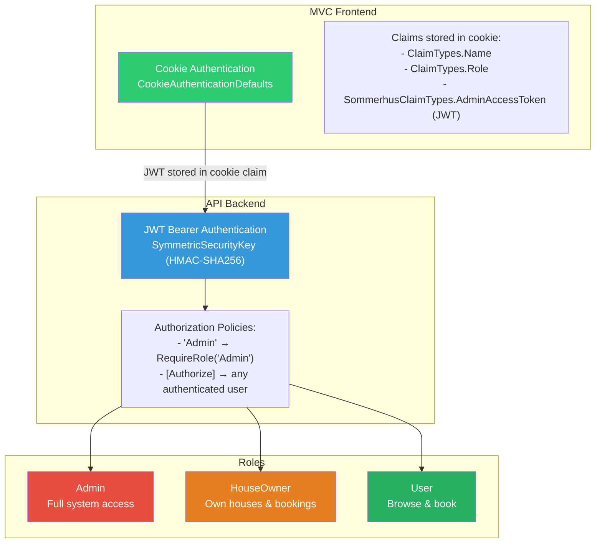
```mermaid
graph TB
    subgraph "MVC Frontend"
        COOKIE["Cookie Authentication<br/>CookieAuthenticationDefaults"]
        CLAIMS["Claims stored in cookie:<br/>- ClaimTypes.Name<br/>- ClaimTypes.Role<br/>- SommerhusClaimTypes.AdminAccessToken (JWT)"]
    end

    subgraph "API Backend"
        JWTAUTH["JWT Bearer Authentication<br/>SymmetricSecurityKey (HMAC-SHA256)"]
        POLICIES["Authorization Policies:<br/>- 'Admin' → RequireRole('Admin')<br/>- [Authorize] → any authenticated user"]
    end

    subgraph "Roles"
        R1["Admin<br/>Full system access"]
        R2["HouseOwner<br/>Own houses & bookings"]
        R3["User<br/>Browse & book"]
    end

    COOKIE -->|"JWT stored in cookie claim"| JWTAUTH
    JWTAUTH --> POLICIES
    POLICIES --> R1 & R2 & R3

    style COOKIE fill:#2ecc71,color:#fff
    style JWTAUTH fill:#3498db,color:#fff
    style R1 fill:#e74c3c,color:#fff
    style R2 fill:#e67e22,color:#fff
    style R3 fill:#27ae60,color:#fff
```

### Route Protection

| Route Pattern                   | Auth      | Role Required           |
| ------------------------------- | --------- | ----------------------- |
| `api/admin/*`                   | JWT       | `Admin`                 |
| `api/owner/*`                   | JWT       | `HouseOwner` or `Admin` |
| `api/auth/*`                    | Anonymous | —                       |
| `api/houses`, `api/areas`, etc. | Anonymous | —                       |
| `api/bookings` (user)           | JWT       | `User`+                 |
| `/admin/*` (MVC)                | Cookie    | `Admin`                 |
| `/account/*` (MVC)              | Anonymous | —                       |
| `/*` (MVC public)               | Anonymous | —                       |

---

## 13. Admin Login Sequence

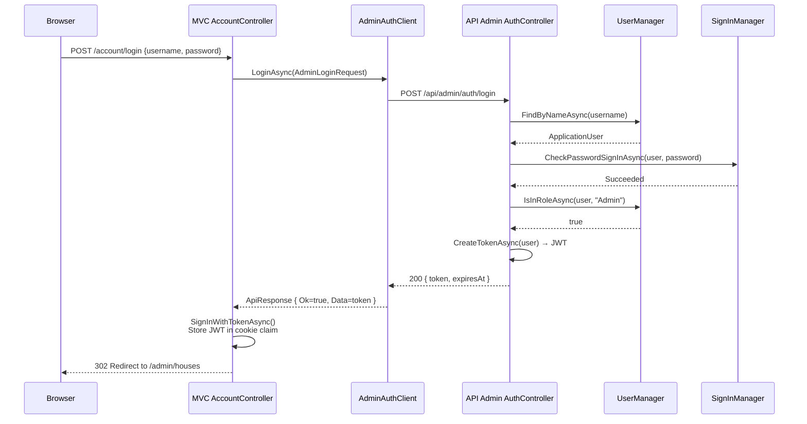
```mermaid
sequenceDiagram
    participant B as Browser
    participant ACC as MVC AccountController
    participant AAUTH as AdminAuthClient
    participant API as API Admin AuthController
    participant UM as UserManager
    participant SM as SignInManager

    B->>ACC: POST /account/login {username, password}
    ACC->>AAUTH: LoginAsync(AdminLoginRequest)
    AAUTH->>API: POST /api/admin/auth/login
    API->>UM: FindByNameAsync(username)
    UM-->>API: ApplicationUser
    API->>SM: CheckPasswordSignInAsync(user, password)
    SM-->>API: Succeeded
    API->>UM: IsInRoleAsync(user, "Admin")
    UM-->>API: true
    API->>API: CreateTokenAsync(user) → JWT
    API-->>AAUTH: 200 { token, expiresAt }
    AAUTH-->>ACC: ApiResponse { Ok=true, Data=token }
    ACC->>ACC: SignInWithTokenAsync()<br/>Store JWT in cookie claim
    ACC-->>B: 302 Redirect to /admin/houses
```

---

## 14. Public User Registration & Login

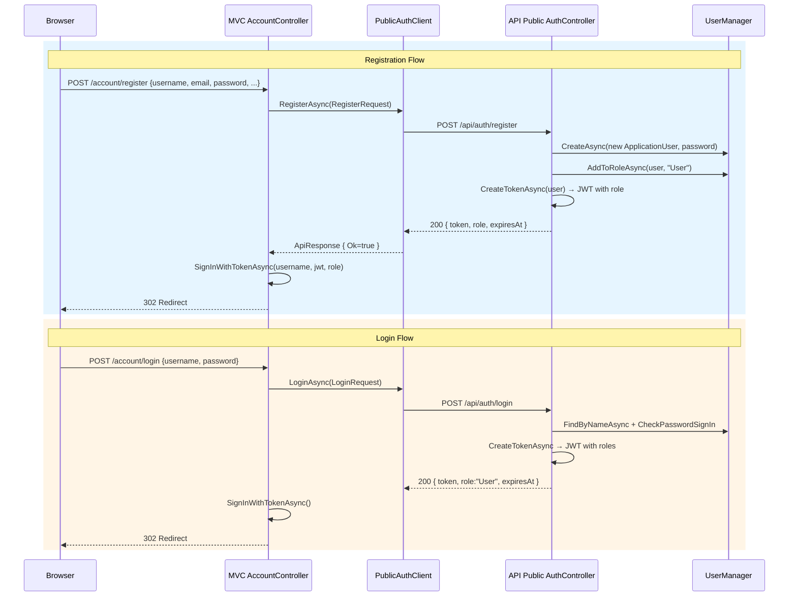
```mermaid
sequenceDiagram
    participant B as Browser
    participant ACC as MVC AccountController
    participant PAUTH as PublicAuthClient
    participant API as API Public AuthController
    participant UM as UserManager

    rect rgb(230, 245, 255)
        Note over B,UM: Registration Flow
        B->>ACC: POST /account/register {username, email, password, ...}
        ACC->>PAUTH: RegisterAsync(RegisterRequest)
        PAUTH->>API: POST /api/auth/register
        API->>UM: CreateAsync(new ApplicationUser, password)
        API->>UM: AddToRoleAsync(user, "User")
        API->>API: CreateTokenAsync(user) → JWT with role
        API-->>PAUTH: 200 { token, role, expiresAt }
        PAUTH-->>ACC: ApiResponse { Ok=true }
        ACC->>ACC: SignInWithTokenAsync(username, jwt, role)
        ACC-->>B: 302 Redirect
    end

    rect rgb(255, 245, 230)
        Note over B,UM: Login Flow
        B->>ACC: POST /account/login {username, password}
        ACC->>PAUTH: LoginAsync(LoginRequest)
        PAUTH->>API: POST /api/auth/login
        API->>UM: FindByNameAsync + CheckPasswordSignIn
        API->>API: CreateTokenAsync → JWT with roles
        API-->>PAUTH: 200 { token, role:"User", expiresAt }
        ACC->>ACC: SignInWithTokenAsync()
        ACC-->>B: 302 Redirect
    end
```

---

## 15. JWT Token Forwarding (MVC → API)

How the MVC frontend authenticates API calls.

```mermaid
graph LR
    subgraph "MVC Request Pipeline"
        REQ[Incoming HTTP Request] --> COOKIE_MW[Cookie Auth Middleware<br/>Reads auth cookie]
        COOKIE_MW --> CLAIMS[ClaimsPrincipal<br/>with JWT in claim]
    end

    subgraph "AdminApiClient Call"
        CLAIMS --> HANDLER[AdminApiAuthHandler<br/>DelegatingHandler]
        HANDLER -->|"Extracts JWT from<br/>SommerhusClaimTypes.AdminAccessToken"| HEADER[Sets Authorization:<br/>Bearer {jwt}]
        HEADER --> HTTP[HttpClient.SendAsync<br/>→ API endpoint]
    end

    subgraph "API"
        HTTP --> JWT_MW[JWT Bearer Middleware<br/>Validates token]
        JWT_MW --> CTRL[Controller<br/>User.Identity available]
    end

    style HANDLER fill:#e74c3c,color:#fff
    style JWT_MW fill:#3498db,color:#fff
```

---

## 16. Image Handling

Architecture of the image storage subsystem.

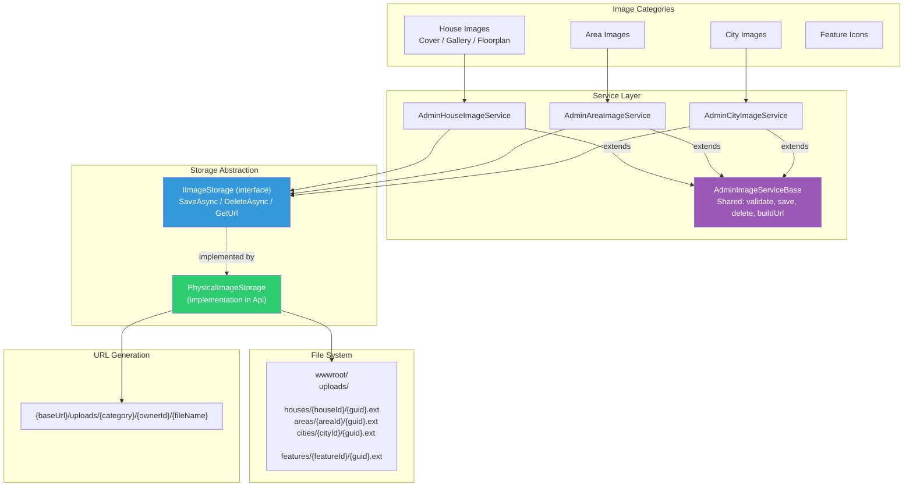
```mermaid
graph TB
    subgraph "Image Categories"
        IC1[House Images<br/>Cover / Gallery / Floorplan]
        IC2[Area Images]
        IC3[City Images]
        IC4[Feature Icons]
    end

    subgraph "Service Layer"
        BASE[AdminImageServiceBase<br/>Shared: validate, save, delete, buildUrl]
        HIS[AdminHouseImageService]
        AIS[AdminAreaImageService]
        CIS[AdminCityImageService]

        HIS & AIS & CIS -->|"extends"| BASE
    end

    subgraph "Storage Abstraction"
        IST["IImageStorage (interface)<br/>SaveAsync / DeleteAsync / GetUrl"]
        PIS["PhysicalImageStorage<br/>(implementation in Api)"]
        IST -.->|"implemented by"| PIS
    end

    subgraph "File System"
        FS["wwwroot/<br/>  uploads/<br/>    houses/{houseId}/{guid}.ext<br/>    areas/{areaId}/{guid}.ext<br/>    cities/{cityId}/{guid}.ext<br/>    features/{featureId}/{guid}.ext"]
    end

    subgraph "URL Generation"
        URL["{baseUrl}/uploads/{category}/{ownerId}/{fileName}"]
    end

    IC1 --> HIS
    IC2 --> AIS
    IC3 --> CIS
    HIS & AIS & CIS --> IST
    PIS --> FS
    PIS --> URL

    style BASE fill:#9b59b6,color:#fff
    style IST fill:#3498db,color:#fff
    style PIS fill:#2ecc71,color:#fff
```

### Image Kind Exclusivity Rules

| ImageKind   | Behavior                                                                   |
| ----------- | -------------------------------------------------------------------------- |
| `Cover`     | Exactly one per house (setting a new cover demotes the old one to Gallery) |
| `Gallery`   | Multiple allowed                                                           |
| `Floorplan` | Exactly one per house (same exclusivity as Cover)                          |

---

## 17. Image Upload Sequence

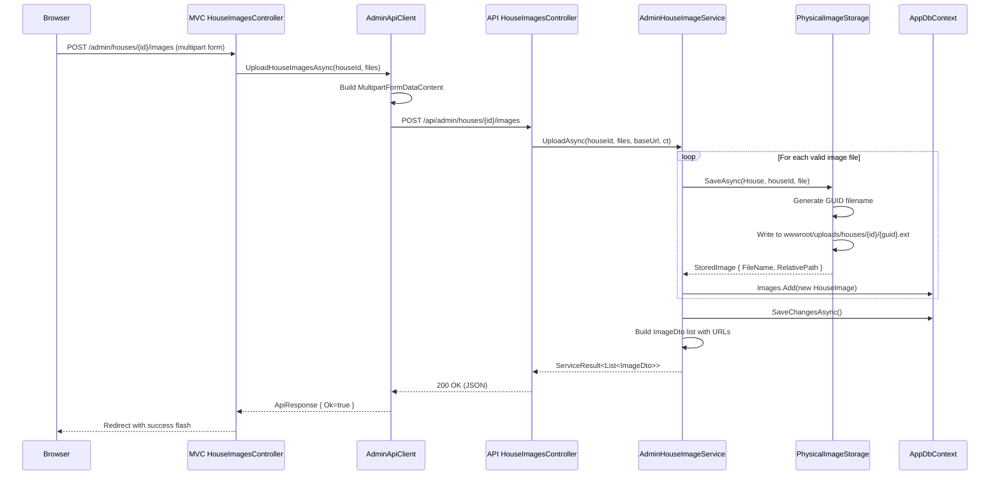
```mermaid
sequenceDiagram
    participant B as Browser
    participant MC as MVC HouseImagesController
    participant AAC as AdminApiClient
    participant API as API HouseImagesController
    participant SVC as AdminHouseImageService
    participant STR as PhysicalImageStorage
    participant DB as AppDbContext

    B->>MC: POST /admin/houses/{id}/images (multipart form)
    MC->>AAC: UploadHouseImagesAsync(houseId, files)
    AAC->>AAC: Build MultipartFormDataContent
    AAC->>API: POST /api/admin/houses/{id}/images
    API->>SVC: UploadAsync(houseId, files, baseUrl, ct)

    loop For each valid image file
        SVC->>STR: SaveAsync(House, houseId, file)
        STR->>STR: Generate GUID filename
        STR->>STR: Write to wwwroot/uploads/houses/{id}/{guid}.ext
        STR-->>SVC: StoredImage { FileName, RelativePath }
        SVC->>DB: Images.Add(new HouseImage)
    end

    SVC->>DB: SaveChangesAsync()
    SVC->>SVC: Build ImageDto list with URLs
    SVC-->>API: ServiceResult<List<ImageDto>>
    API-->>AAC: 200 OK (JSON)
    AAC-->>MC: ApiResponse { Ok=true }
    MC-->>B: Redirect with success flash
```

---

## 18. Pricing Engine Pipeline

The rule-based pricing calculation system.

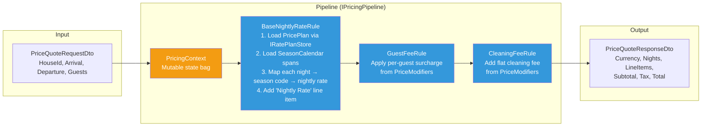
```mermaid
graph LR
    subgraph "Input"
        REQ["PriceQuoteRequestDto<br/>HouseId, Arrival, Departure, Guests"]
    end

    subgraph "Pipeline (IPricingPipeline)"
        CTX["PricingContext<br/>Mutable state bag"]

        R1["BaseNightlyRateRule<br/>1. Load PricePlan via IRatePlanStore<br/>2. Load SeasonCalendar spans<br/>3. Map each night → season code → nightly rate<br/>4. Add 'Nightly Rate' line item"]
        R2["GuestFeeRule<br/>Apply per-guest surcharge<br/>from PriceModifiers"]
        R3["CleaningFeeRule<br/>Add flat cleaning fee<br/>from PriceModifiers"]
    end

    subgraph "Output"
        RESP["PriceQuoteResponseDto<br/>Currency, Nights, LineItems,<br/>Subtotal, Tax, Total"]
    end

    REQ --> CTX
    CTX --> R1 --> R2 --> R3
    R3 --> RESP

    style CTX fill:#f39c12,color:#fff
    style R1 fill:#3498db,color:#fff
    style R2 fill:#3498db,color:#fff
    style R3 fill:#3498db,color:#fff
```

### Pricing Data Resolution

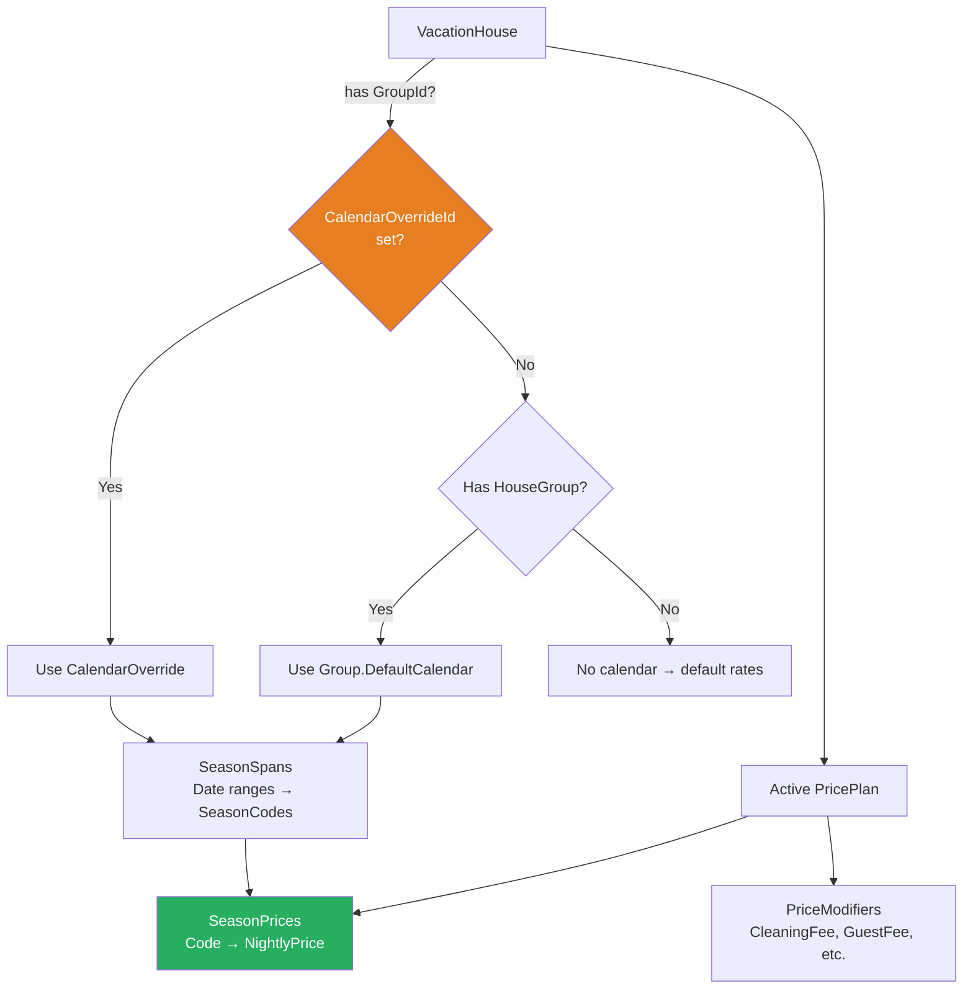
```mermaid
graph TB
    HOUSE[VacationHouse] -->|"has GroupId?"| CHECK{CalendarOverrideId<br/>set?}

    CHECK -->|Yes| OVR[Use CalendarOverride]
    CHECK -->|No| GRP{Has HouseGroup?}
    GRP -->|Yes| GCAL[Use Group.DefaultCalendar]
    GRP -->|No| NONE[No calendar → default rates]

    OVR & GCAL --> SPANS[SeasonSpans<br/>Date ranges → SeasonCodes]
    SPANS --> PRICES[SeasonPrices<br/>Code → NightlyPrice]

    HOUSE --> PP[Active PricePlan]
    PP --> PRICES
    PP --> MODS[PriceModifiers<br/>CleaningFee, GuestFee, etc.]

    style CHECK fill:#e67e22,color:#fff
    style PRICES fill:#27ae60,color:#fff
```

---

## 19. Price Quote Sequence

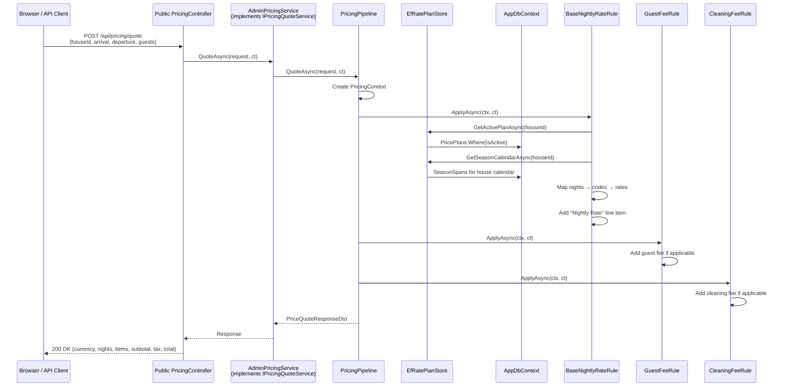
```mermaid
sequenceDiagram
    participant Client as Browser / API Client
    participant API as Public PricingController
    participant SVC as AdminPricingService<br/>(implements IPricingQuoteService)
    participant PIPE as PricingPipeline
    participant STORE as EfRatePlanStore
    participant DB as AppDbContext
    participant R1 as BaseNightlyRateRule
    participant R2 as GuestFeeRule
    participant R3 as CleaningFeeRule

    Client->>API: POST /api/pricing/quote<br/>{houseId, arrival, departure, guests}
    API->>SVC: QuoteAsync(request, ct)
    SVC->>PIPE: QuoteAsync(request, ct)
    PIPE->>PIPE: Create PricingContext

    PIPE->>R1: ApplyAsync(ctx, ct)
    R1->>STORE: GetActivePlanAsync(houseId)
    STORE->>DB: PricePlans.Where(IsActive)
    R1->>STORE: GetSeasonCalendarAsync(houseId)
    STORE->>DB: SeasonSpans for house calendar
    R1->>R1: Map nights → codes → rates
    R1->>R1: Add "Nightly Rate" line item

    PIPE->>R2: ApplyAsync(ctx, ct)
    R2->>R2: Add guest fee if applicable

    PIPE->>R3: ApplyAsync(ctx, ct)
    R3->>R3: Add cleaning fee if applicable

    PIPE-->>SVC: PriceQuoteResponseDto
    SVC-->>API: Response
    API-->>Client: 200 OK {currency, nights, items, subtotal, tax, total}
```

---

## 20. Booking Lifecycle

State machine for booking status transitions.

```mermaid
stateDiagram-v2
    [*] --> Pending : Guest creates booking

    Pending --> Confirmed : Owner/Admin confirms
    Pending --> Cancelled : Guest/Owner/Admin cancels

    Confirmed --> Completed : Check-out date passes
    Confirmed --> Cancelled : Owner/Admin cancels

    Completed --> [*]
    Cancelled --> [*]

    note right of Pending
        AvailabilityBlock created
        with Source=Booking
    end note

    note right of Confirmed
        ConfirmedAtUtc set
    end note

    note right of Cancelled
        CancelledAtUtc set
        CancelledBy recorded
        AvailabilityBlock released
    end note
```

### Booking Status Values

| Status      | Value | Description                   |
| ----------- | ----- | ----------------------------- |
| `Pending`   | 0     | Awaiting owner confirmation   |
| `Confirmed` | 1     | Owner approved, dates blocked |
| `Completed` | 2     | Stay finished                 |
| `Cancelled` | 3     | Cancelled by any party        |

---

## 21. Entity Lifecycle (Draft → Published → Archived)

Used by VacationHouse and Area entities.

```mermaid
stateDiagram-v2
    [*] --> Draft : Entity created

    Draft --> Published : Admin publishes
    Draft --> Archived : Admin archives

    Published --> Archived : Admin archives
    Published --> Draft : Admin unpublishes

    Archived --> Draft : Admin restores

    note right of Draft
        EntityStatus = 0
        Not visible to public
    end note

    note right of Published
        EntityStatus = 1
        Visible to guests
        PublishedAtUtc set
    end note

    note right of Archived
        EntityStatus = 2
        Soft-deleted
        ArchivedAtUtc set
    end note
```

> Managed by `IEntityLifecycleService.TransitionHouseAsync()` / `TransitionAreaAsync()`

---

## 22. Availability & Booking Integration

How availability blocks interact with bookings.

```mermaid
graph TB
    subgraph "Availability Sources"
        MAN[Manual Block<br/>Source = Manual<br/>Admin blocks dates]
        ICAL[iCal Sync<br/>Source = ICalSync<br/>External calendar]
        BOOK[Booking Block<br/>Source = Booking<br/>Auto-created on booking]
    end

    subgraph "AvailabilityBlock"
        AB["AvailabilityBlock<br/>HouseId, StartDate, EndDate<br/>Status, Source, Note"]
    end

    subgraph "Status Values"
        S1[Available = 0]
        S2[Blocked = 1]
        S3[Tentative = 2]
        S4[Booked = 3]
    end

    MAN & ICAL & BOOK --> AB
    AB --> S1 & S2 & S3 & S4

    subgraph "Booking"
        BK["Booking<br/>Links to AvailabilityBlock<br/>via AvailabilityBlockId"]
    end

    BOOK -.->|"creates"| AB
    BK -.->|"references"| AB

    style AB fill:#e74c3c,color:#fff
    style BK fill:#3498db,color:#fff
```

---

## 23. ServiceResult Pattern

The unified return type for all service operations.

```mermaid
classDiagram
    class ServiceResult {
        +ServiceResultStatus Status
        +bool IsSuccess
        +IReadOnlyDictionary Errors
        +Success() ServiceResult
        +NotFound() ServiceResult
        +Invalid(field, msg) ServiceResult
        +Conflict(field, msg) ServiceResult
        +Unavailable(msg) ServiceResult
    }

    class ServiceResultT~T~ {
        +T? Value
        +Success(T value) ServiceResultT
        +NotFound() ServiceResultT
        +Invalid(field, msg) ServiceResultT
        +Conflict(field, msg) ServiceResultT
        +Unavailable(msg) ServiceResultT
    }

    class ServiceResultStatus {
        <<enumeration>>
        Success
        NotFound
        Invalid
        Conflict
        Unavailable
    }

    ServiceResult <|-- ServiceResultT : extends
    ServiceResult --> ServiceResultStatus : uses
```

---

## 24. ServiceResult → HTTP Response Mapping

How `ControllerExtensions.FromResult()` translates service outcomes to HTTP.

```mermaid
graph LR
    subgraph "ServiceResult Status"
        S1[Success]
        S2[NotFound]
        S3[Invalid]
        S4[Conflict]
        S5[Unavailable]
    end

    subgraph "HTTP Response"
        H1["200 OK (with value)<br/>or 204 No Content"]
        H2[404 Not Found]
        H3["422 Validation Problem<br/>(ValidationProblemDetails)"]
        H4["409 Conflict<br/>(ProblemDetails)"]
        H5["503 Service Unavailable<br/>(ProblemDetails)"]
    end

    subgraph "MVC ApiResponse"
        A1["ApiResponse { Ok=true, Data=T }"]
        A2["ApiResponse { Ok=false, StatusCode=404 }"]
        A3["ApiResponse { Ok=false, Errors={} }"]
        A4["ApiResponse { Ok=false, Message=... }"]
        A5["ApiResponse { Ok=false, Message=... }"]
    end

    S1 --> H1 --> A1
    S2 --> H2 --> A2
    S3 --> H3 --> A3
    S4 --> H4 --> A4
    S5 --> H5 --> A5

    style S1 fill:#27ae60,color:#fff
    style S2 fill:#f39c12,color:#fff
    style S3 fill:#e74c3c,color:#fff
    style S4 fill:#e74c3c,color:#fff
    style S5 fill:#e74c3c,color:#fff
```

> **Unhandled exceptions** are caught by `ProblemDetailsMiddleware` and returned as `500 Internal Server Error` with `ProblemDetails` JSON.

---

## 25. Audit System

Automatic change tracking via EF Core interceptor.

```mermaid
graph TB
    subgraph "Tracked Entities"
        TE["VacationHouse, Area, Feature,<br/>HouseGroup, PricePlan, SeasonPrice"]
    end

    subgraph "AuditSaveChangesInterceptor"
        BS["BeforeSave()<br/>1. Auto-set IAuditable timestamps<br/>   (CreatedAtUtc, UpdatedAtUtc, By)<br/>2. Capture pending audit entries"]
        AS["AfterSave()<br/>1. Write AuditEntry rows<br/>2. SaveChanges() again"]
    end

    subgraph "AuditEntry"
        AE["EntityType, EntityId<br/>Action (Created/Updated/Deleted)<br/>ChangedBy (from JWT claims)<br/>ChangedAtUtc<br/>Changes (JSON diff)"]
    end

    subgraph "Change Formats"
        CR["Created: full property snapshot"]
        UP["Updated: {prop: {from, to}}"]
        DL["Deleted: full original values"]
    end

    TE --> BS
    BS -->|"SaveChanges"| AS
    AS --> AE
    AE --> CR & UP & DL

    style BS fill:#e67e22,color:#fff
    style AS fill:#e67e22,color:#fff
    style AE fill:#3498db,color:#fff
```

### Audit JSON Examples

**Created**:

```json
{ "title": "Beach Villa", "address": "Strandvej 1", "status": 0 }
```

**Updated**:

```json
{
  "title": { "from": "Beach Villa", "to": "Luxury Beach Villa" },
  "status": { "from": 0, "to": 1 }
}
```

---

## 26. API Error Handling Pipeline

How errors flow through the API.

```mermaid
graph TB
    REQ[Incoming Request] --> MW[ProblemDetailsMiddleware]
    MW --> AUTH[Authentication / Authorization]
    AUTH -->|"401/403"| ERR1[Unauthorized / Forbidden]
    AUTH -->|OK| CTRL[Controller]
    CTRL --> SVC[Service Method]

    SVC -->|"returns ServiceResult"| FR["FromResult()<br/>Maps to ActionResult"]

    FR -->|Success| OK[200/204]
    FR -->|NotFound| NF[404]
    FR -->|Invalid| VP[422 ValidationProblemDetails]
    FR -->|Conflict| CF[409 ProblemDetails]
    FR -->|Unavailable| UA[503 ProblemDetails]

    SVC -->|"throws Exception"| MW
    MW -->|"catch"| PD["500 ProblemDetails<br/>{type, title, status, detail?, instance}"]

    style MW fill:#e74c3c,color:#fff
    style FR fill:#3498db,color:#fff
    style VP fill:#f39c12,color:#fff
    style PD fill:#c0392b,color:#fff
```

---

## 27. MVC API Client Architecture

The layered HTTP communication from MVC to API.

```mermaid
graph TB
    subgraph "Typed Clients"
        AAC["AdminApiClient<br/>Admin CRUD operations"]
        SAC["SommerhusApi<br/>Public read operations"]
        AAUTH["AdminAuthClient<br/>Admin login"]
        PAUTH["PublicAuthClient<br/>User login/register"]
    end

    subgraph "Shared Infrastructure"
        APIHTTP["ApiHttp (static)<br/>Get/Post/Put/Delete/Send<br/>Handles serialization & errors"]
        ARESP["ApiResponse&lt;T&gt;<br/>Ok, Data, StatusCode,<br/>Message, Errors"]
    end

    subgraph "Auth Pipeline (Admin only)"
        HANDLER["AdminApiAuthHandler<br/>DelegatingHandler<br/>Extracts JWT from cookie claims<br/>Sets Authorization header"]
    end

    subgraph "Error Parsing (in ApiHttp)"
        E1["ValidationProblemDetails → Errors dict"]
        E2["Dictionary&lt;string,string[]&gt; → Errors dict"]
        E3["ProblemDetails → Message"]
        E4["Raw text → Message"]
    end

    AAC --> HANDLER --> APIHTTP
    SAC & AAUTH & PAUTH --> APIHTTP
    APIHTTP --> ARESP
    APIHTTP --> E1 & E2 & E3 & E4

    style APIHTTP fill:#3498db,color:#fff
    style HANDLER fill:#e74c3c,color:#fff
    style ARESP fill:#27ae60,color:#fff
```

---

## 28. Service Registration Overview

How services are organized and registered in DI.

```mermaid
graph TB
    subgraph "Program.cs (API)"
        P["builder.Services<br/>.AddSommerhusPersistence(config)<br/>.AddAdminServices()<br/>.AddPublicServices()<br/>.AddOwnerServices()<br/>.AddStorageServices(config)<br/>.AddPricingServices()<br/>.AddDevServices()"]
    end

    subgraph "Core: AddSommerhusPersistence"
        CP["AppDbContext (SQLite/SqlServer)<br/>Identity (ApplicationUser + Roles)<br/>AdminIdentitySeeder<br/>MigrationHostedService<br/>AuditSaveChangesInterceptor"]
    end

    subgraph "Api: AddAdminServices (16)"
        A1["AdminAreaService<br/>AdminCityService<br/>AdminFeatureService<br/>AdminHouseGroupService"]
        A2["AdminHouseService<br/>AdminHouseFeatureService<br/>AdminHousePricingService"]
        A3["AdminAreaImageService<br/>AdminCityImageService<br/>AdminHouseImageService"]
        A4["AdminPricingService<br/>AdminCalendarService<br/>AdminAvailabilityService<br/>AdminBookingService"]
        A5["AuditService<br/>EntityLifecycleService"]
    end

    subgraph "Api: AddPublicServices (8)"
        PB["HouseQueryService<br/>AreaQueryService<br/>FeatureQueryService<br/>CityQueryService<br/>ZipCodeQueryService<br/>HouseImageQueryService<br/>AvailabilityQueryService<br/>BookingService"]
    end

    subgraph "Api: AddOwnerServices (3)"
        OW["OwnerAuthorizationService<br/>OwnerHouseService<br/>OwnerBookingService"]
    end

    subgraph "Api: AddPricingServices (4)"
        PR["EfRatePlanStore<br/>BaseNightlyRateRule<br/>GuestFeeRule<br/>CleaningFeeRule<br/>PricingPipeline"]
    end

    subgraph "Api: AddStorageServices"
        ST["StorageOptions<br/>PhysicalImageStorage (Singleton)"]
    end

    P --> CP & A1 & A2 & A3 & A4 & A5 & PB & OW & PR & ST

    style P fill:#2c3e50,color:#fff
    style CP fill:#8e44ad,color:#fff
```

---

## 29. Database Provider Selection

How the app decides which database to use.

```mermaid
flowchart TD
    START[App Startup] --> CONFIG{"appsettings<br/>DatabaseProvider<br/>configured?"}

    CONFIG -->|"'SqlServer'"| SQLSERVER[(SQL Server)]
    CONFIG -->|"'Sqlite'"| SQLITE[(SQLite)]
    CONFIG -->|Not set| CONNSTR{"Connection string<br/>contains 'Server=' or<br/>'Initial Catalog='?"}

    CONNSTR -->|Yes| SQLSERVER
    CONNSTR -->|No| SQLITE

    SQLITE -->|Default| DEFCONN["Data Source=sommerhus.db"]

    style SQLSERVER fill:#3498db,color:#fff
    style SQLITE fill:#27ae60,color:#fff
```

---

## 30. Application Startup Sequence

What happens when the API starts.

```mermaid
sequenceDiagram
    participant HOST as WebApplication
    participant DI as DI Container
    participant MIG as MigrationHostedService
    participant DB as AppDbContext
    participant SEED as AdminIdentitySeeder
    participant DEV as Seeder

    HOST->>DI: Build services
    Note over DI: Register persistence, services,<br/>auth, Swagger, CORS

    HOST->>HOST: Build app pipeline
    Note over HOST: UseStaticFiles → UseCors →<br/>ProblemDetailsMiddleware →<br/>UseAuthentication → UseAuthorization →<br/>UseSwagger → MapControllers

    HOST->>MIG: StartAsync()
    MIG->>DB: Database.MigrateAsync()
    Note over DB: Apply pending EF migrations
    MIG->>SEED: SeedAsync()
    Note over SEED: Create Admin role + default admin user<br/>from DefaultAdmin config
    MIG->>MIG: IsDevelopment()?
    alt Development
        MIG->>DEV: SeedMinimal(db)
        Note over DEV: Insert sample houses, areas, cities
    end

    HOST->>HOST: RunAsync()
    Note over HOST: Listening on configured port
```

---

## 31. Use Cases by Role

```mermaid
graph TB
    subgraph "Guest (Anonymous / User)"
        G1[Browse houses with filters]
        G2[View house details & images]
        G3[Browse areas & cities]
        G4[Get price quote]
        G5[Check availability]
        G6[Create booking]
        G7[View own bookings]
        G8[Cancel own booking]
        G9[Register / Login]
    end

    subgraph "House Owner"
        O1[View own houses]
        O2[View bookings for own houses]
        O3[Confirm / reject bookings]
        O4[Add owner notes to bookings]
    end

    subgraph "Administrator"
        A1[Full CRUD: Houses, Areas, Cities]
        A2[Manage features & feature values]
        A3[Upload / delete images]
        A4[Configure pricing plans & seasons]
        A5[Manage season calendars & codes]
        A6[Manage house groups]
        A7[Block / unblock availability]
        A8[Manage all bookings]
        A9[Publish / archive entities]
        A10[View audit log]
        A11[Manage users & roles]
        A12[Assign house ownership]
    end

    style G1 fill:#27ae60,color:#fff
    style O1 fill:#e67e22,color:#fff
    style A1 fill:#e74c3c,color:#fff
```

---

## Quick Reference: Key File Locations

| Concern                  | File(s)                                                             |
| ------------------------ | ------------------------------------------------------------------- |
| **API Entry Point**      | `Sommerhus.Api/Program.cs`                                          |
| **MVC Entry Point**      | `Sommerhus.Mvc/Program.cs`                                          |
| **DI Registration**      | `Sommerhus.Api/Extensions/ServiceCollectionExtensions.cs`           |
| **DB + Identity Setup**  | `Sommerhus.Core/ServiceCollectionExtensions.cs`                     |
| **EF DbContext**         | `Sommerhus.Core/Data/DbContext.cs`                                  |
| **ServiceResult**        | `Sommerhus.Core/Common/ServiceResult.cs`                            |
| **FromResult mapping**   | `Sommerhus.Api/Infrastructure/ControllerExtensions.cs`              |
| **Error middleware**     | `Sommerhus.Api/ProblemDetailsMiddleware.cs`                         |
| **JWT config**           | `Sommerhus.Api/Infrastructure/Auth/JwtOptions.cs`                   |
| **Image storage**        | `Sommerhus.Api/Infrastructure/Storage/PhysicalImageStorage.cs`      |
| **Image interface**      | `Sommerhus.Core/Services/Storage/IImageStorage.cs`                  |
| **Pricing pipeline**     | `Sommerhus.Core/Services/Pricing/Engine/PricingPipeline.cs`         |
| **Price rules**          | `Sommerhus.Core/Services/Pricing/Engine/Rules/`                     |
| **Audit interceptor**    | `Sommerhus.Core/Data/AuditSaveChangesInterceptor.cs`                |
| **MVC API clients**      | `Sommerhus.Mvc/Services/AdminApiClient.cs`, `SommerhusApi.cs`       |
| **JWT forwarding**       | `Sommerhus.Mvc/Services/AdminApiAuthHandler.cs`                     |
| **API response wrapper** | `Sommerhus.Mvc/Services/ApiResponse.cs`, `ApiHttp.cs`               |
| **Domain models**        | `Sommerhus.Domain/Models/`                                          |
| **DTOs**                 | `Sommerhus.Core/Dtos/`                                              |
| **Test factory**         | `Sommerhus.Api.Tests/Infrastructure/CustomWebApplicationFactory.cs` |
