# Architecture Diagrams

This document contains architectural diagrams for the Sommerhus vacation house rental platform.

---

## Frontpage Image Retrieval Architecture

### Current Flow Analysis

Based on your diagram and the actual codebase, here's the corrected architecture for image retrieval when a user visits the frontpage:

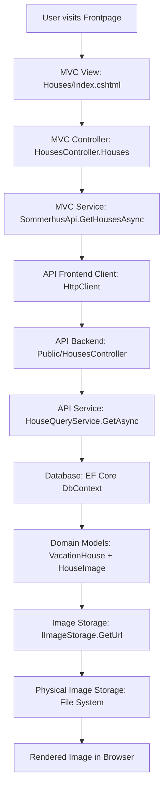

### Key Components & DTOs

#### Image DTOs

```csharp
// Domain Layer
public class HouseImage
{
    public Guid Id { get; set; }
    public Guid HouseId { get; set; }
    public string FileName { get; set; }
    public string? Alt { get; set; }
    public ImageKind Kind { get; set; } // Cover, Gallery, FloorPlan
}

// Contracts Layer
public record ImageDto(
    Guid Id,
    string Url,
    string? Alt,
    string Kind
);

// Storage Layer
public sealed record StoredImage(string FileName, string RelativePath);
```

#### Storage Abstraction

```csharp
public interface IImageStorage
{
    Task<StoredImage> SaveAsync(ImageCategory category, Guid ownerId, IFormFile file, CancellationToken ct);
    Task DeleteAsync(ImageCategory category, Guid ownerId, string fileName, CancellationToken ct);
    string GetUrl(HttpRequest request, ImageCategory category, Guid ownerId, string fileName);
    string GetRelativePath(ImageCategory category, Guid ownerId, string fileName);
}
```

### Corrections to Your Diagram

Your diagram was mostly correct, but here are the important corrections:

1. **Service Layer Naming**:
   - ✅ Correct: `HouseImageQueryService` (not `HouseImageService`)
   - Located in: `Sommerhus.Repository.Public.Images`

2. **Controller Structure**:
   - ✅ Correct: `HouseImagesController` is separate from `HousesController`
   - Route: `/api/houses/{houseId:guid}/images`

3. **DTO Flow**:
   - ✅ Correct: `ImageDto` is used, not separate `Image` and `StoredImage` in the response
   - `StoredImage` is internal to storage operations

4. **Database Query**:
   - The service queries `HouseImage` entities directly from DbContext
   - Images are ordered by `ImageKind` (Cover first, then Gallery, then FloorPlan)

### Detailed Request Flow

1. **Frontend Request**: `GET /houses` (house listing page)
2. **MVC Controller**: Calls `SommerhusApi.GetHousesAsync()`
3. **API Call**: `GET /api/houses` (returns house list with cover image URLs)
4. **Image URLs**: Generated by `IImageStorage.GetUrl()` using pattern:
   - `/images/houses/{houseId}/{fileName}`

### Image Loading Pattern

For individual house details:

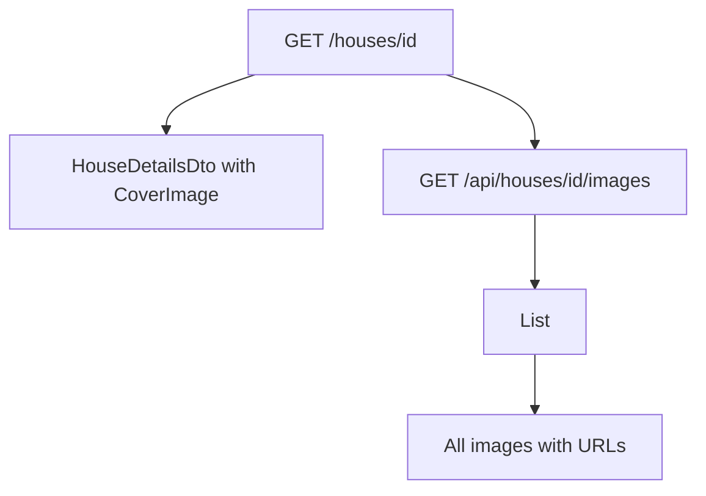

### Storage Implementation

The `PhysicalImageStorage` implementation:

- Stores files in: `wwwroot/images/{category}/{ownerId}/`
- Generates URLs: `/images/{category}/{ownerId}/{fileName}`
- Handles all image categories: House, Area, City, Feature

---

## Application Startup & Data Seeding Architecture

### Startup Flow Diagram

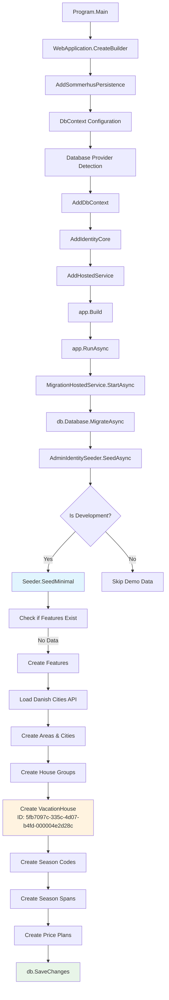

### Critical Issue: House ID Mismatch

Your theory about the house ID mismatch is likely correct. Here's what happens:

#### The Problem:

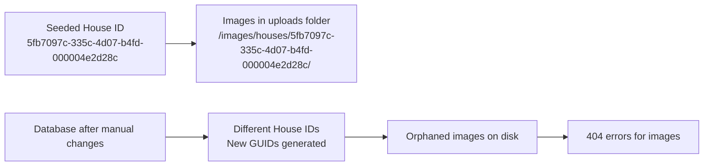

#### Root Causes:

1. **Database Recreation**: If you delete the database, new houses get new GUIDs
2. **Manual Data Changes**: Adding houses through admin UI creates different IDs
3. **Seeding Logic**: `Seeder.SeedMinimal()` only runs if `db.Features.Any()` is false

#### Startup Sequence Details:

1. **Migration Phase** (`MigrationHostedService.StartAsync()`):

   ```csharp
   await db.Database.MigrateAsync(cancellationToken);  // Ensures schema
   ```

2. **Identity Seeding** (`AdminIdentitySeeder.SeedAsync()`):

   ```csharp
   // Creates admin user if not exists
   // Creates Admin role if not exists
   ```

3. **Demo Data Seeding** (Development only):
   ```csharp
   if (environment.IsDevelopment())
   {
       Seeder.SeedMinimal(db);  // Only if Features table is empty
   }
   ```

### House ID Seeding Logic

The seeder creates a **fixed house ID**:

```csharp
var house = new VacationHouse
{
    Id = new Guid("5fb7097c-335c-4d07-b4fd-000004e2d28c"), // Hard-coded!
    Title = "Blåvand Strand 4",
    // ... other properties
};
```

But if you:

- Delete the database and restart
- Or add houses through the admin UI
- Or run seeding multiple times with different logic

You'll get **different house IDs** while images remain in the original folder structure.

### Solutions:

#### Option 1: Clean Slate (Recommended)

```bash
# Delete database and images
rm sommerhus.db
rm -rf wwwroot/images/houses/*

# Restart application
dotnet run --project Sommerhus.Api
```

#### Option 2: Image Cleanup Script

```csharp
// Add to MigrationHostedService after seeding
private async Task CleanupOrphanedImagesAsync(AppDbContext db)
{
    var validHouseIds = await db.Houses.Select(h => h.Id).ToListAsync();
    var imagesPath = Path.Combine("wwwroot", "images", "houses");

    // Remove folders for non-existent houses
    foreach (var folder in Directory.GetDirectories(imagesPath))
    {
        var folderName = Path.GetFileName(folder);
        if (Guid.TryParse(folderName, out var houseId) && !validHouseIds.Contains(houseId))
        {
            Directory.Delete(folder, recursive: true);
        }
    }
}
```

#### Option 3: Dynamic Seeding

Modify `Seeder.SeedMinimal()` to check for existing houses before creating new ones.

---

## Complete Data Flow Architecture: From Database to Frontend

### Overview Diagram

This diagram shows the complete end-to-end data flow for a typical house listing request, from database storage through all transformations until it reaches the user's browser.

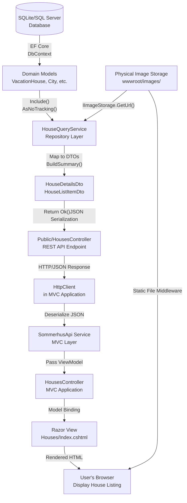

### Detailed Data Transformations

#### 1. Database to Domain Models

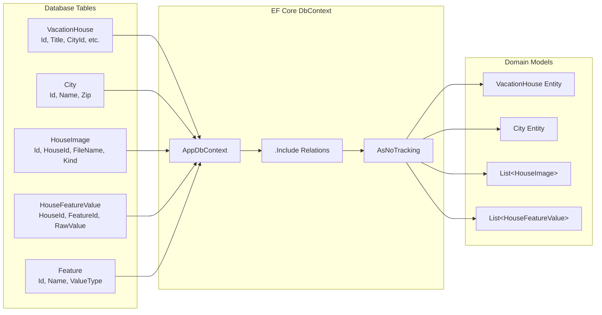

#### 2. Domain Models to DTOs

```mermaid
graph TD
    subgraph "Domain Models (Input)"
        HOUSE[VacationHouse<br/>Title, Description, etc.]
        HOUSE_CITY[City<br/>Name, Zip]
        HOUSE_IMAGES[List&lt;HouseImage&gt;<br/>FileName, Kind, Alt]
        HOUSE_FEATURES[List&lt;HouseFeatureValue&gt;<br/>RawValue]
        FEATURES[Feature<br/>Name, ValueType, Unit]
    end

    subgraph "Service Logic"
        STORAGE[IImageStorage<br/>GetUrl()]
        SUMMARY[BuildSummary()<br/>HTML Strip, Truncate]
        MAP[Mapping Logic]
    end

    subgraph "DTOs (Output)"
        HOUSE_DTO[HouseDetailsDto<br/>Id, Title, City, etc.]
        IMAGE_DTOS[List&lt;ImageDto&gt;<br/>Id, Url, Alt, Kind]
        FEATURE_DTOS[List&lt;FeatureValueDto&gt;<br/>Id, Name, RawValue]
    end

    HOUSE --> MAP
    HOUSE_CITY --> MAP
    HOUSE_IMAGES --> STORAGE
    HOUSE_FEATURES --> MAP
    FEATURES --> MAP
    HOUSE --> SUMMARY

    STORAGE --> IMAGE_DTOS
    MAP --> HOUSE_DTO
    MAP --> FEATURE_DTOS
    SUMMARY --> HOUSE_DTO
```

#### 3. API Response Format

```json
// HouseDetailsDto Response
{
  "id": "5fb7097c-335c-4d07-b4fd-000004e2d28c",
  "title": "Blåvand Strand 4",
  "city": "Blåvand",
  "zip": "6857",
  "address": "Strandvejen 123",
  "description": "Beautiful beach house...",
  "images": [
    {
      "id": "image-guid-1",
      "url": "/images/houses/5fb7097c-335c-4d07-b4fd-000004e2d28c/cover.jpg",
      "alt": "Beach view from terrace",
      "kind": "Cover"
    }
  ],
  "features": [
    {
      "id": "feature-guid-1",
      "name": "Swimming Pool",
      "valueType": "Boolean",
      "unit": null,
      "iconUrl": "/images/features/pool.svg",
      "rawValue": "true"
    }
  ]
}
```

---

## System Architecture Overview

### Clean Architecture Layers

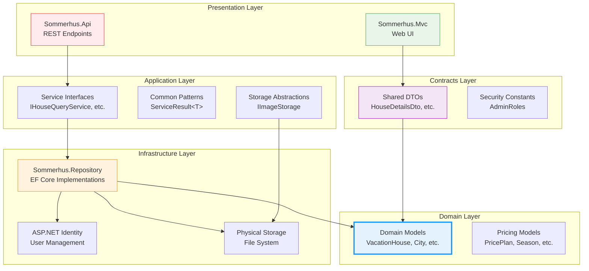

### Dependency Injection Flow

```mermaid
graph TD
    PROGRAM[Program.Main()] --> BUILDER[WebApplication.CreateBuilder()]

    BUILDER --> PERSISTENCE[AddSommerhusPersistence()]
    BUILDER --> AUTH[AddAuthentication()]
    BUILDER --> CONTROLLERS[AddControllers()]
    BUILDER --> SERVICES[Add Services]

    PERSISTENCE --> DB_CONTEXT[AddDbContext&lt;AppDbContext&gt;]
    PERSISTENCE --> IDENTITY[AddIdentityCore]

    SERVICES --> ADMIN_SERVICES[AddAdminServices()]
    SERVICES --> PUBLIC_SERVICES[AddPublicServices()]
    SERVICES --> STORAGE_SERVICES[AddStorageServices()]

    ADMIN_SERVICES --> ADMIN_HOUSES[AdminHouseService]
    PUBLIC_SERVICES --> HOUSE_QUERY[HouseQueryService]
    STORAGE_SERVICES --> IMAGE_STORAGE[PhysicalImageStorage]

    DB_CONTEXT --> MIGRATION[MigrationHostedService]
    MIGRATION --> SEEDING[Database Seeding]

    style PROGRAM fill:#e3f2fd,stroke:#2196f3
    style DB_CONTEXT fill:#f3e5f5,stroke:#9c27b0
    style ADMIN_HOUSES fill:#ffebee,stroke:#f44336
    style HOUSE_QUERY fill:#e8f5e8,stroke:#4caf50
    style IMAGE_STORAGE fill:#fff3e0,stroke:#ff9800
```

---

## Authentication & Authorization Flow

### JWT Token Flow

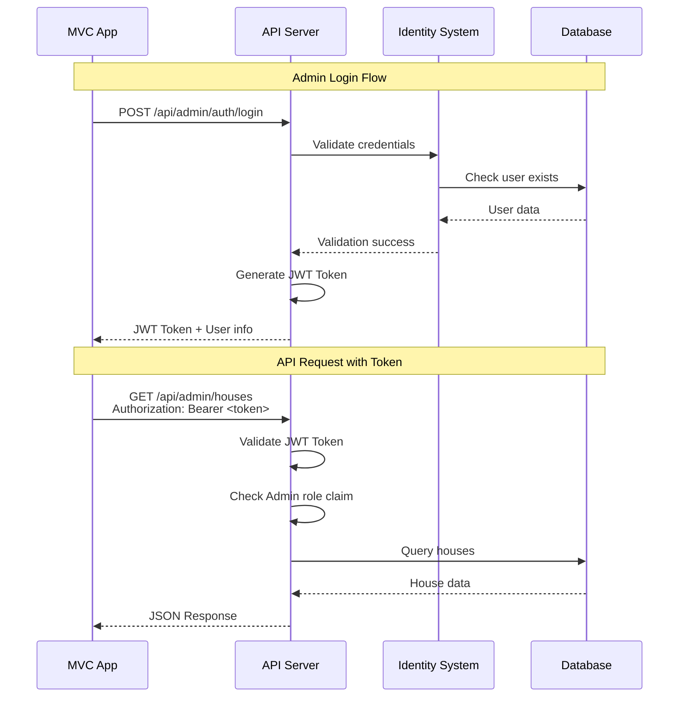

### Role-Based Access Control

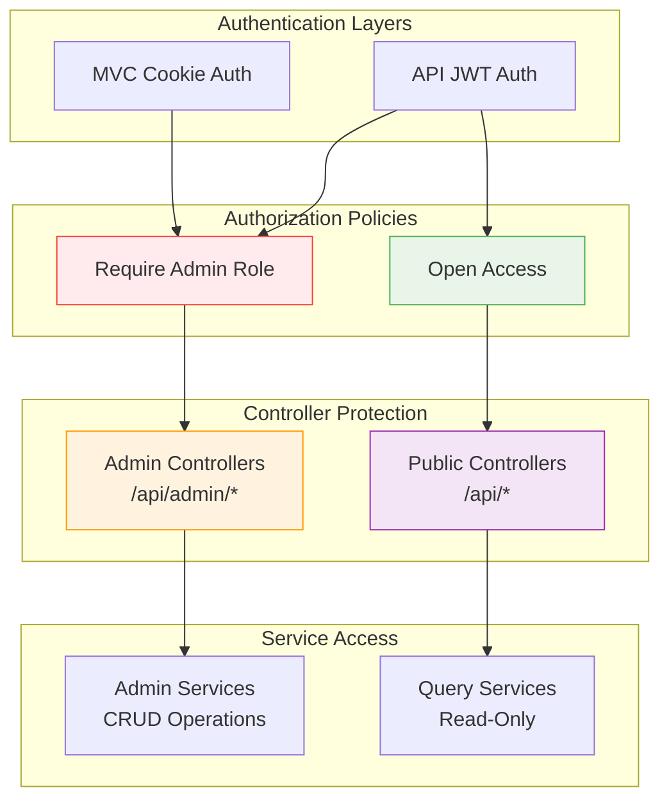

---

## Image Storage Architecture

### Image Upload & Retrieval Flow

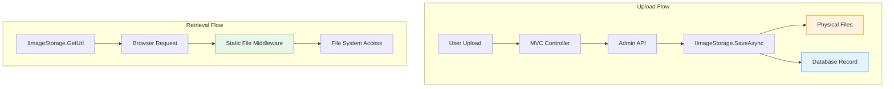

### Image Storage Structure

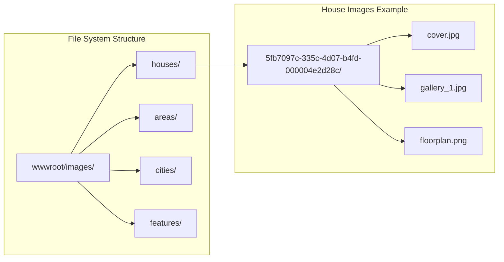

---

## Pricing Engine Architecture (Reserved)

### Future Pricing Pipeline

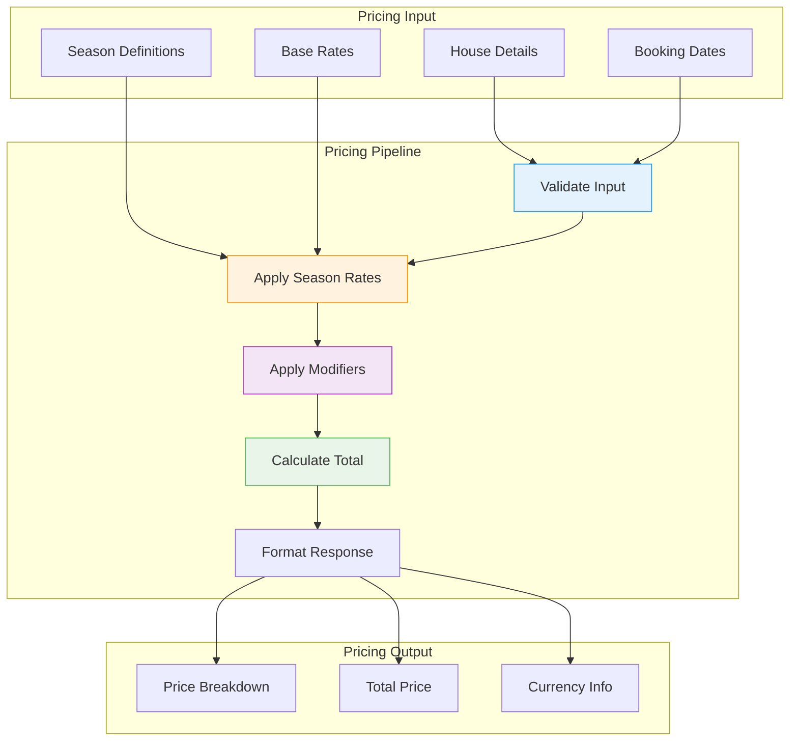

---

## Testing Architecture

### Test Structure & Flow

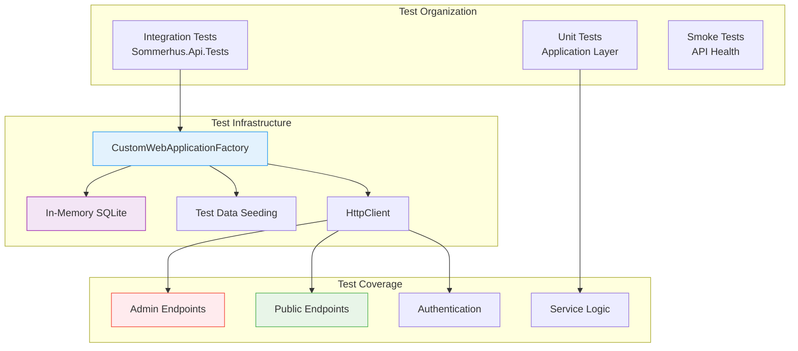

---

## Deployment Architecture

### Development vs Production

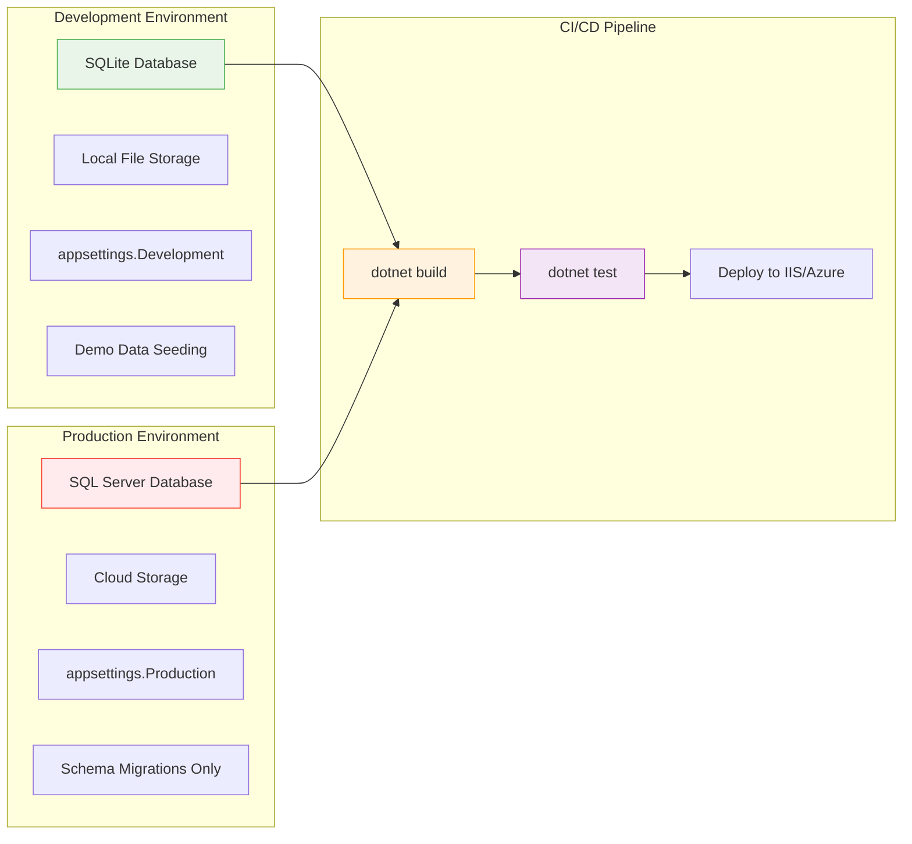

---

## Complete Sommerhus Architecture Reference Diagram

### Overview: Full System Architecture with All Components

This comprehensive diagram shows the entire Sommerhus vacation house rental platform architecture, including all layers, components, data flows, and responsibilities.

```mermaid
graph TB
    %% External Systems
    USER[User Browser] --> MVC_APP
    ADMIN[Admin Browser] --> MVC_APP

    %% Presentation Layer
    subgraph "Presentation Layer"
        MVC_APP[Sommerhus.Mvc<br/>Razor Web Application]
        API_APP[Sommerhus.Api<br/>REST API Server]

        subgraph "MVC Components"
            MVC_CONTROLLERS[Controllers<br/>Admin/Public/Account]
            MVC_VIEWS[Views<br/>Razor Templates]
            MVC_MODELS[ViewModels<br/>Typed ViewModels]
            MVC_SERVICES[API Clients<br/>SommerhusApi, AdminApiClient]
            MVC_AUTH[Cookie Authentication]
        end

        subgraph "API Components"
            API_CONTROLLERS[Controllers<br/>Admin/Public Endpoints]
            API_MIDDLEWARE[Middleware<br/>Auth, CORS, Static Files]
            API_AUTH[JWT Authentication]
            API_SWAGGER[Swagger/OpenAPI]
        end
    end

    %% Business Logic Layer (Core)
    subgraph "Business Logic Layer (Sommerhus.Core)"
        subgraph "Service Interfaces & Implementations"
            ADMIN_SERVICES[Admin Services<br/>CRUD Operations]
            PUBLIC_SERVICES[Query Services<br/>Read-Only Operations]
            PRICING_SERVICES[Pricing Engine<br/>Rate Calculation Pipeline]
            STORAGE_SERVICES[Storage Services<br/>IImageStorage Abstraction]
        end

        subgraph "Data Transfer Objects"
            ADMIN_DTOS[Admin DTOs<br/>UpsertDto, Write Models]
            PUBLIC_DTOS[Public DTOs<br/>Read Models, Summaries]
            SHARED_DTOS[Shared DTOs<br/>Common Models]
            SECURITY_DTOS[Security DTOs<br/>Auth, Roles]
        end

        subgraph "Common Patterns"
            SERVICE_RESULT[ServiceResult&lt;T&gt;<br/>Standard Result Wrapper]
            PAGINATION[Pagination DTOs<br/>PagedResponse, PagingParams]
        end

        subgraph "Data Access"
            DB_CONTEXT[AppDbContext<br/>EF Core Context]
            MIGRATIONS[Migrations<br/>Schema Management]
            SEEDING[Database Seeding<br/>Demo Data, Admin User]
        end

        subgraph "Identity & Security"
            IDENTITY[ASP.NET Identity<br/>ApplicationUser, Roles]
            IDENTITY_SEEDER[AdminIdentitySeeder<br/>Default Admin Creation]
        end
    end

    %% Domain Layer
    subgraph "Domain Layer (Sommerhus.Domain)"
        subgraph "Core Entities"
            VACATION_HOUSE[VacationHouse<br/>Main Property Entity]
            CITY[City<br/>Location Entity]
            AREA[Area<br/>Geographic Region]
            FEATURE[Feature<br/>Property Features]
            HOUSE_GROUP[HouseGroup<br/>Pricing Groups]
        end

        subgraph "Relationship Entities"
            HOUSE_FEATURE[HouseFeatureValue<br/>Feature Values per House]
            HOUSE_IMAGE[HouseImage<br/>Image Metadata]
            AREA_CITIES[AreaCities<br/>M-N Relationship]
            HOUSE_AREAS[HouseAreas<br/>M-N Relationship]
        end

        subgraph "Pricing Domain"
            PRICE_PLAN[PricePlan<br/>House Pricing Strategy]
            SEASON_CODE[SeasonCode<br/>Season Definitions]
            SEASON_PRICE[SeasonPrice<br/>Seasonal Rates]
            SEASON_SPAN[SeasonSpan<br/>Date Ranges]
            PRICE_MODIFIER[PriceModifier<br/>Additional Fees]
        end

        subgraph "Enums & Types"
            IMAGE_KIND[ImageKind<br/>Cover, Gallery, FloorPlan]
            FEATURE_TYPE[FeatureValueType<br/>Boolean, Number, Text]
        end
    end

    %% Infrastructure Layer
    subgraph "Infrastructure Layer"
        subgraph "Database"
            SQLITE_DEV[SQLite<br/>Development Database]
            SQLSERVER_PROD[SQL Server<br/>Production Database]
            DB_PROVIDER[Provider Auto-Detection<br/>Based on Connection String]
        end

        subgraph "File Storage"
            PHYSICAL_STORAGE[Physical File Storage<br/>wwwroot/images/]
            IMAGE_CATEGORIES[Image Categories<br/>Houses, Areas, Cities, Features]
        end

        subgraph "HTTP Infrastructure"
            HTTP_CLIENTS[HttpClient Factories<br/>API Communication]
            CORS_POLICY[CORS Configuration<br/>MVC ↔ API Communication]
        end
    end

    %% Testing Layer
    subgraph "Testing Layer (Sommerhus.Api.Tests)"
        INTEGRATION_TESTS[Integration Tests<br/>Full API Testing]
        UNIT_TESTS[Unit Tests<br/>Service Logic Testing]
        TEST_INFRA[Test Infrastructure<br/>WebApplicationFactory, In-Memory DB]
        SMOKE_TESTS[Smoke Tests<br/>API Health Checks]
    end

    %% External Dependencies
    subgraph "External Dependencies"
        ASPNET_CORE[ASP.NET Core 8<br/>Web Framework]
        EF_CORE[Entity Framework Core<br/>ORM]
        IDENTITY_CORE[ASP.NET Core Identity<br/>Authentication]
        SWAGGER_LIB[Swashbuckle/Swagger<br/>API Documentation]
    end

    %% Data Flow Connections
    USER --> MVC_VIEWS
    ADMIN --> MVC_VIEWS
    MVC_VIEWS --> MVC_CONTROLLERS
    MVC_CONTROLLERS --> MVC_SERVICES
    MVC_SERVICES --> API_APP
    MVC_AUTH --> MVC_SERVICES

    API_APP --> API_MIDDLEWARE
    API_MIDDLEWARE --> API_CONTROLLERS
    API_AUTH --> API_CONTROLLERS

    API_CONTROLLERS --> ADMIN_SERVICES
    API_CONTROLLERS --> PUBLIC_SERVICES

    ADMIN_SERVICES --> DB_CONTEXT
    PUBLIC_SERVICES --> DB_CONTEXT
    PRICING_SERVICES --> DB_CONTEXT
    STORAGE_SERVICES --> PHYSICAL_STORAGE

    DB_CONTEXT --> SQLITE_DEV
    DB_CONTEXT --> SQLSERVER_PROD

    ADMIN_SERVICES --> ADMIN_DTOS
    PUBLIC_SERVICES --> PUBLIC_DTOS
    ADMIN_SERVICES --> SERVICE_RESULT
    PUBLIC_SERVICES --> SERVICE_RESULT

    DB_CONTEXT --> VACATION_HOUSE
    DB_CONTEXT --> CITY
    DB_CONTEXT --> AREA
    DB_CONTEXT --> FEATURE
    DB_CONTEXT --> PRICE_PLAN

    VACATION_HOUSE --> HOUSE_FEATURE
    VACATION_HOUSE --> HOUSE_IMAGE
    VACATION_HOUSE --> HOUSE_AREAS

    IDENTITY --> IDENTITY_SEEDER
    IDENTITY_SEEDER --> DB_CONTEXT

    INTEGRATION_TESTS --> API_APP
    UNIT_TESTS --> ADMIN_SERVICES
    UNIT_TESTS --> PUBLIC_SERVICES

    %% Styling for clarity
    style USER fill:#e1f5fe,stroke:#01579b
    style ADMIN fill:#fff3e0,stroke:#e65100
    style MVC_APP fill:#e8f5e8,stroke:#1b5e20
    style API_APP fill:#ffebee,stroke:#b71c1c
    style VACATION_HOUSE fill:#f3e5f5,stroke:#4a148c,stroke-width:3px
    style DB_CONTEXT fill:#fff8e1,stroke:#f57f17,stroke-width:2px
    style SERVICE_RESULT fill:#e0f2f1,stroke:#004d40
    style INTEGRATION_TESTS fill:#fce4ec,stroke:#880e4f
```

### Layer Responsibilities Matrix

| Layer              | Primary Responsibilities                 | Key Components                                         | Data Flow             |
| ------------------ | ---------------------------------------- | ------------------------------------------------------ | --------------------- |
| **Presentation**   | User interface, HTTP handling            | MVC Controllers/Views, API Controllers, Authentication | User ↔ Application    |
| **Business Logic** | Core business rules, data orchestration  | Services, DTOs, DbContext, Business Validation         | API ↔ Database        |
| **Domain**         | Pure business entities, no dependencies  | POCO Models, Entity Relationships, Domain Rules        | Immutable definitions |
| **Infrastructure** | External concerns, persistence           | Database, File Storage, HTTP Clients                   | Physical resources    |
| **Testing**        | Quality assurance, regression prevention | Integration Tests, Unit Tests, Test Fixtures           | Validation layer      |

### Component Interaction Patterns

#### 1. Request Processing Flow

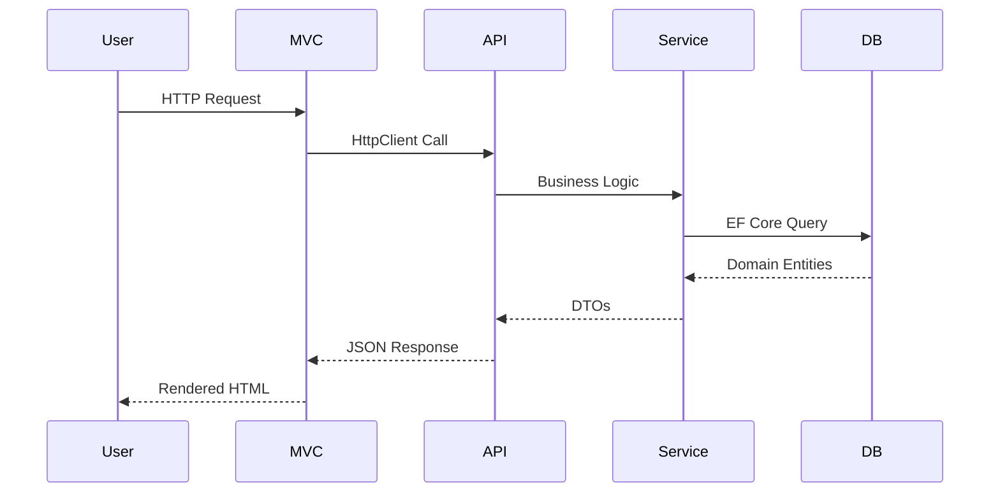

#### 2. Authentication Flow

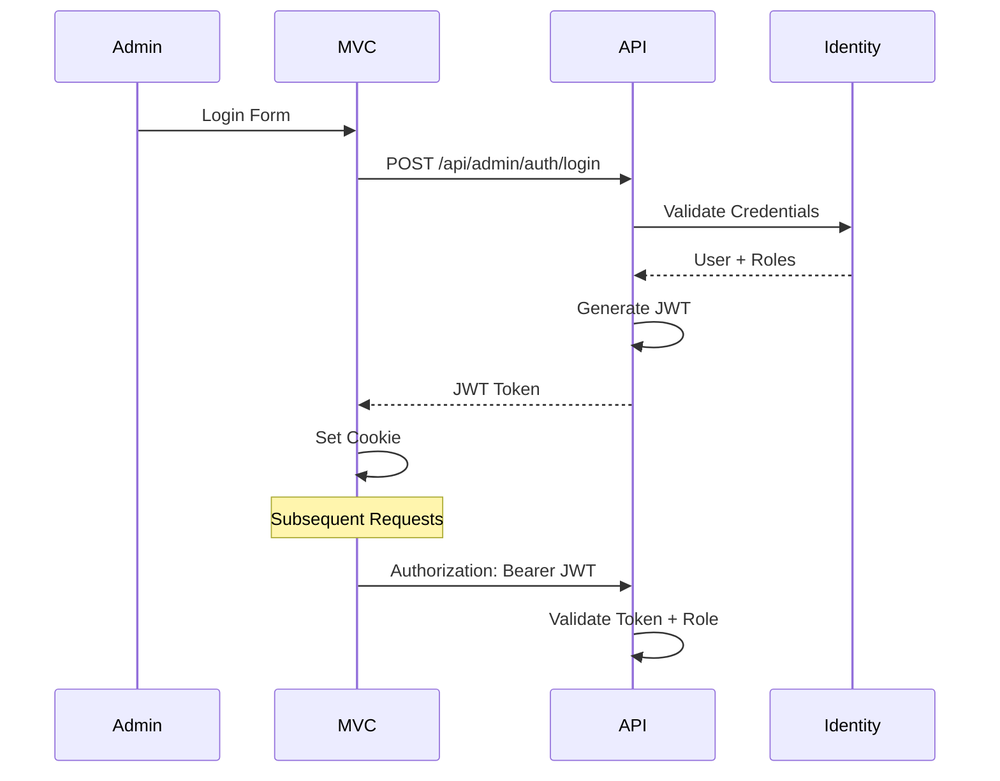

#### 3. Data Persistence Flow

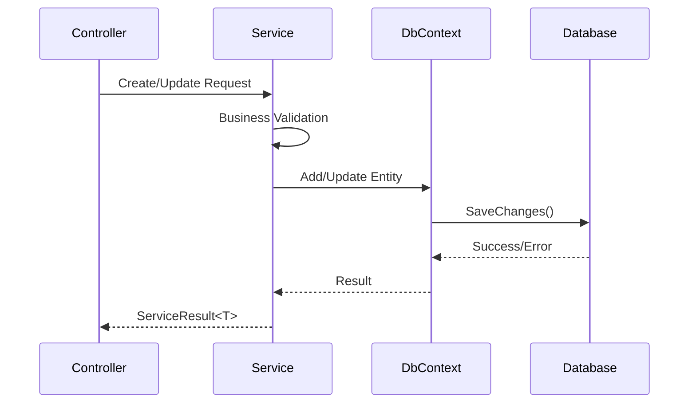

### Service Architecture Details

#### Admin Services (Write Operations)

- **IAdminHouseService**: House CRUD, feature management
- **IAdminAreaService**: Area management, city assignments
- **IAdminCityService**: City CRUD, area associations
- **IAdminFeatureService**: Feature definitions, value types
- **IAdminHouseGroupService**: Pricing group management
- **IAdminPricingService**: Price plan configuration
- **IAdminHouseImageService**: Image upload/management

#### Public Services (Read Operations)

- **IHouseQueryService**: House search, details, summaries
- **IAreaQueryService**: Area listings, house counts
- **ICityQueryService**: City information, house availability
- **IFeatureQueryService**: Feature definitions, icons
- **IZipCodeQueryService**: Geographic search
- **IHouseImageQueryService**: Image retrieval, URLs

#### Pricing Engine (Specialized)

- **IPricingPipeline**: Main pricing orchestration
- **IRatePlanStore**: Rate plan data access
- **IPriceRule**: Pricing calculation rules
  - BaseNightlyRateRule
  - SeasonalAdjustmentRule
  - CleaningFeeRule
  - GuestFeeRule
  - TaxRule

### Database Schema Relationships

```mermaid
erDiagram
    VacationHouse ||--o{ HouseImage : has
    VacationHouse ||--o{ HouseFeatureValue : has
    VacationHouse }o--|| City : belongs_to
    VacationHouse }o--o| Area : located_in
    VacationHouse }o--|| HouseGroup : grouped_by

    City ||--o{ AreaCities : contains
    Area ||--o{ AreaCities : includes

    Feature ||--o{ HouseFeatureValue : applied_to

    PricePlan ||--o{ SeasonPrice : contains
    SeasonCode ||--o{ SeasonPrice : defines
    SeasonSpan ||--o{ SeasonPrice : dates

    HouseGroup ||--o{ VacationHouse : groups
```

### Configuration Management

#### Environment-Specific Settings

- **Development**: SQLite + Demo Data Seeding
- **Testing**: In-Memory SQLite + Isolated Data
- **Production**: SQL Server + Migrations Only

#### Key Configuration Sections

```json
{
  "ConnectionStrings": { "Default": "Database connection" },
  "DatabaseProvider": "Sqlite|SqlServer",
  "Jwt": { "Issuer", "Audience", "Key", "AccessTokenMinutes" },
  "DefaultAdmin": { "UserName", "Password", "Email" },
  "Api": { "BaseUrl": "API endpoint URL" },
  "Storage": { "BasePath": "Image storage location" }
}
```

### Deployment Architecture

#### Development Environment

```
localhost:5001 - MVC Application
localhost:5183 - API Server
localhost:7202 - Alternative MVC port
SQLite Database - sommerhus.db
Local File Storage - wwwroot/images/
```

#### Production Environment

```
IIS/Azure Hosting - MVC + API
SQL Server Database - Persistent storage
Cloud Storage - Image assets (future)
Load Balancer - Traffic distribution
SSL/TLS - Security encryption
```

### Testing Strategy Overview

#### Integration Tests

- **Scope**: Full HTTP request/response cycle
- **Database**: In-memory SQLite, auto-seeded
- **Authentication**: JWT token generation
- **Coverage**: All API endpoints, error scenarios

#### Unit Tests

- **Scope**: Individual service methods
- **Focus**: Business logic, validation rules
- **Mocking**: External dependencies
- **Coverage**: Critical business paths

#### Smoke Tests

- **Scope**: Application health checks
- **Validation**: API availability, database connectivity
- **Automation**: CI/CD pipeline integration

---

## Future Diagrams

_This section will be updated with new architectural diagrams as the system evolves._
