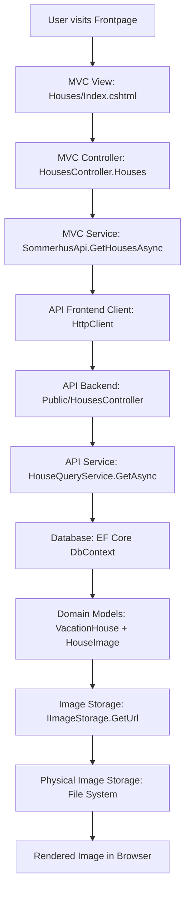
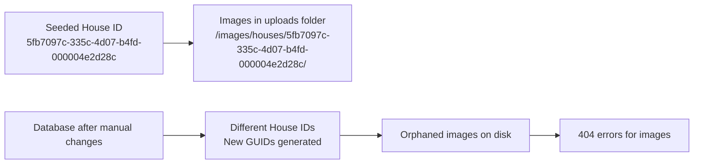

# Architecture Diagrams

This document contains architectural diagrams for the Sommerhus vacation house rental platform.

---

## Frontpage Image Retrieval Architecture

### Current Flow Analysis

Based on your diagram and the actual codebase, here's the corrected architecture for image retrieval when a user visits the frontpage:



### Key Components & DTOs

#### Image DTOs

```csharp
// Domain Layer
public class HouseImage
{
    public Guid Id { get; set; }
    public Guid HouseId { get; set; }
    public string FileName { get; set; }
    public string? Alt { get; set; }
    public ImageKind Kind { get; set; } // Cover, Gallery, FloorPlan
}

// Contracts Layer
public record ImageDto(
    Guid Id,
    string Url,
    string? Alt,
    string Kind
);

// Storage Layer
public sealed record StoredImage(string FileName, string RelativePath);
```

#### Storage Abstraction

```csharp
public interface IImageStorage
{
    Task<StoredImage> SaveAsync(ImageCategory category, Guid ownerId, IFormFile file, CancellationToken ct);
    Task DeleteAsync(ImageCategory category, Guid ownerId, string fileName, CancellationToken ct);
    string GetUrl(HttpRequest request, ImageCategory category, Guid ownerId, string fileName);
    string GetRelativePath(ImageCategory category, Guid ownerId, string fileName);
}
```

### Corrections to Your Diagram

Your diagram was mostly correct, but here are the important corrections:

1. **Service Layer Naming**:
   - ✅ Correct: `HouseImageQueryService` (not `HouseImageService`)
   - Located in: `Sommerhus.Repository.Public.Images`

2. **Controller Structure**:
   - ✅ Correct: `HouseImagesController` is separate from `HousesController`
   - Route: `/api/houses/{houseId:guid}/images`

3. **DTO Flow**:
   - ✅ Correct: `ImageDto` is used, not separate `Image` and `StoredImage` in the response
   - `StoredImage` is internal to storage operations

4. **Database Query**:
   - The service queries `HouseImage` entities directly from DbContext
   - Images are ordered by `ImageKind` (Cover first, then Gallery, then FloorPlan)

### Detailed Request Flow

1. **Frontend Request**: `GET /houses` (house listing page)
2. **MVC Controller**: Calls `SommerhusApi.GetHousesAsync()`
3. **API Call**: `GET /api/houses` (returns house list with cover image URLs)
4. **Image URLs**: Generated by `IImageStorage.GetUrl()` using pattern:
   - `/images/houses/{houseId}/{fileName}`

### Image Loading Pattern

For individual house details:

```mermaid
graph TD
    A[GET /houses/{id}] --> B[HouseDetailsDto with CoverImage]
    A --> C[GET /api/houses/{id}/images] --> D[List<ImageDto>]
    D --> E[All images with URLs]
```

### Storage Implementation

The `PhysicalImageStorage` implementation:

- Stores files in: `wwwroot/images/{category}/{ownerId}/`
- Generates URLs: `/images/{category}/{ownerId}/{fileName}`
- Handles all image categories: House, Area, City, Feature

---

## Application Startup & Data Seeding Architecture

### Startup Flow Diagram

```mermaid
graph TD
    A[Program.Main()] --> B[WebApplication.CreateBuilder()]
    B --> C[AddSommerhusPersistence()]
    C --> D[DbContext Configuration]
    D --> E[Database Provider Detection]
    E --> F[AddDbContext<AppDbContext>]
    F --> G[AddIdentityCore<ApplicationUser>]
    G --> H[AddHostedService<MigrationHostedService>]
    H --> I[app.Build()]
    I --> J[app.RunAsync()]
    J --> K[MigrationHostedService.StartAsync()]

    K --> L[db.Database.MigrateAsync()]
    L --> M[AdminIdentitySeeder.SeedAsync()]
    M --> N{Is Development?}
    N -->|Yes| O[Seeder.SeedMinimal()]
    N -->|No| P[Skip Demo Data]

    O --> Q[Check if Features Exist]
    Q -->|No Data| R[Create Features]
    R --> S[Load Danish Cities API]
    S --> T[Create Areas & Cities]
    T --> U[Create House Groups]
    U --> V[Create VacationHouse<br/>ID: 5fb7097c-335c-4d07-b4fd-000004e2d28c]
    V --> W[Create Season Codes]
    W --> X[Create Season Spans]
    X --> Y[Create Price Plans]
    Y --> Z[db.SaveChanges()]

    style O fill:#e1f5fe
    style V fill:#fff3e0
    style Z fill:#e8f5e8
```

### Critical Issue: House ID Mismatch

Your theory about the house ID mismatch is likely correct. Here's what happens:

#### The Problem:



#### Root Causes:

1. **Database Recreation**: If you delete the database, new houses get new GUIDs
2. **Manual Data Changes**: Adding houses through admin UI creates different IDs
3. **Seeding Logic**: `Seeder.SeedMinimal()` only runs if `db.Features.Any()` is false

#### Startup Sequence Details:

1. **Migration Phase** (`MigrationHostedService.StartAsync()`):

   ```csharp
   await db.Database.MigrateAsync(cancellationToken);  // Ensures schema
   ```

2. **Identity Seeding** (`AdminIdentitySeeder.SeedAsync()`):

   ```csharp
   // Creates admin user if not exists
   // Creates Admin role if not exists
   ```

3. **Demo Data Seeding** (Development only):
   ```csharp
   if (environment.IsDevelopment())
   {
       Seeder.SeedMinimal(db);  // Only if Features table is empty
   }
   ```

### House ID Seeding Logic

The seeder creates a **fixed house ID**:

```csharp
var house = new VacationHouse
{
    Id = new Guid("5fb7097c-335c-4d07-b4fd-000004e2d28c"), // Hard-coded!
    Title = "Blåvand Strand 4",
    // ... other properties
};
```

But if you:

- Delete the database and restart
- Or add houses through the admin UI
- Or run seeding multiple times with different logic

You'll get **different house IDs** while images remain in the original folder structure.

### Solutions:

#### Option 1: Clean Slate (Recommended)

```bash
# Delete database and images
rm sommerhus.db
rm -rf wwwroot/images/houses/*

# Restart application
dotnet run --project Sommerhus.Api
```

#### Option 2: Image Cleanup Script

```csharp
// Add to MigrationHostedService after seeding
private async Task CleanupOrphanedImagesAsync(AppDbContext db)
{
    var validHouseIds = await db.Houses.Select(h => h.Id).ToListAsync();
    var imagesPath = Path.Combine("wwwroot", "images", "houses");

    // Remove folders for non-existent houses
    foreach (var folder in Directory.GetDirectories(imagesPath))
    {
        var folderName = Path.GetFileName(folder);
        if (Guid.TryParse(folderName, out var houseId) && !validHouseIds.Contains(houseId))
        {
            Directory.Delete(folder, recursive: true);
        }
    }
}
```

#### Option 3: Dynamic Seeding

Modify `Seeder.SeedMinimal()` to check for existing houses before creating new ones.

---

## Future Diagrams

_This section will be updated with new architectural diagrams as the system evolves._
